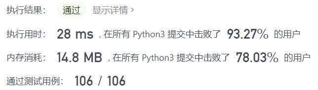
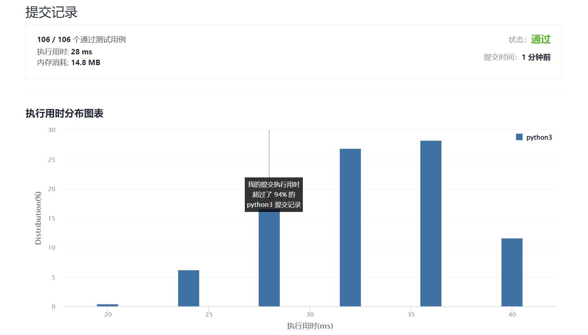

# 1716-计算力扣银行的钱

Author：_Mumu

创建日期：2022/01/15

通过日期：2022/01/15

*****

踩过的坑：

1. 轻松愉快的等差数列求和

已解决：208/2492

*****

难度：简单

问题描述：

Hercy 想要为购买第一辆车存钱。他 每天 都往力扣银行里存钱。

最开始，他在周一的时候存入 1 块钱。从周二到周日，他每天都比前一天多存入 1 块钱。在接下来每一个周一，他都会比 前一个周一 多存入 1 块钱。

给你 n ，请你返回在第 n 天结束的时候他在力扣银行总共存了多少块钱。

 

示例 1：

输入：n = 4
输出：10
解释：第 4 天后，总额为 1 + 2 + 3 + 4 = 10 。
示例 2：

输入：n = 10
输出：37
解释：第 10 天后，总额为 (1 + 2 + 3 + 4 + 5 + 6 + 7) + (2 + 3 + 4) = 37 。注意到第二个星期一，Hercy 存入 2 块钱。
示例 3：

输入：n = 20
输出：96
解释：第 20 天后，总额为 (1 + 2 + 3 + 4 + 5 + 6 + 7) + (2 + 3 + 4 + 5 + 6 + 7 + 8) + (3 + 4 + 5 + 6 + 7 + 8) = 96 。

提示：

1 <= n <= 1000

来源：力扣（LeetCode）
链接：https://leetcode-cn.com/problems/calculate-money-in-leetcode-bank
