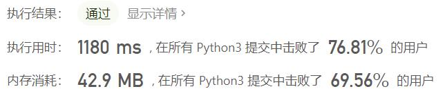

# 1734-解码异或后的排列

Author：_Mumu

创建日期：2021/5/19

通过日期：2021/5/19

*****

踩过的坑：

1. 本题的关键是找出异或矩阵的递推计算方式，以减小计算量，根据异或的性质是很容易能得到的；
2. 坑的话是python的特性导致的坑，最开始我用的是语句`xor_matrix = [[0] * n] * m`来构建初始异或矩阵，但是这样的构建方式使得矩阵的每一行指向的是同一个列表对象，于是修改矩阵某一行的任意位置都会导致其他每一行的相同位置一起发生变化，太坑了；
3. 解决方式是使用`xor_matrix = [[0] * n for _ in range(m)]`，这样就不会有如上问题；
4. 另外还有一个trick是初始矩阵上方与左侧增加一行一列，这样就不需要单独写计算异或矩阵第一行第一列的代码了。

已解决：22/2089

*****

难度：中等

问题描述：

给你一个二维矩阵 matrix 和一个整数 k ，矩阵大小为 m x n 由非负整数组成。

矩阵中坐标 (a, b) 的 值 可由对所有满足 0 <= i <= a < m 且 0 <= j <= b < n 的元素 matrix[i][j]（下标从 0 开始计数）执行异或运算得到。

请你找出 matrix 的所有坐标中第 k 大的值（k 的值从 1 开始计数）。

 

示例 1：

输入：matrix = [[5,2],[1,6]], k = 1
输出：7
解释：坐标 (0,1) 的值是 5 XOR 2 = 7 ，为最大的值。
示例 2：

输入：matrix = [[5,2],[1,6]], k = 2
输出：5
解释：坐标 (0,0) 的值是 5 = 5 ，为第 2 大的值。
示例 3：

输入：matrix = [[5,2],[1,6]], k = 3
输出：4
解释：坐标 (1,0) 的值是 5 XOR 1 = 4 ，为第 3 大的值。
示例 4：

输入：matrix = [[5,2],[1,6]], k = 4
输出：0
解释：坐标 (1,1) 的值是 5 XOR 2 XOR 1 XOR 6 = 0 ，为第 4 大的值。

提示：

m == matrix.length
n == matrix[i].length
1 <= m, n <= 1000
0 <= matrix[i][j] <= 106
1 <= k <= m * n

来源：力扣（LeetCode）
链接：https://leetcode-cn.com/problems/find-kth-largest-xor-coordinate-value