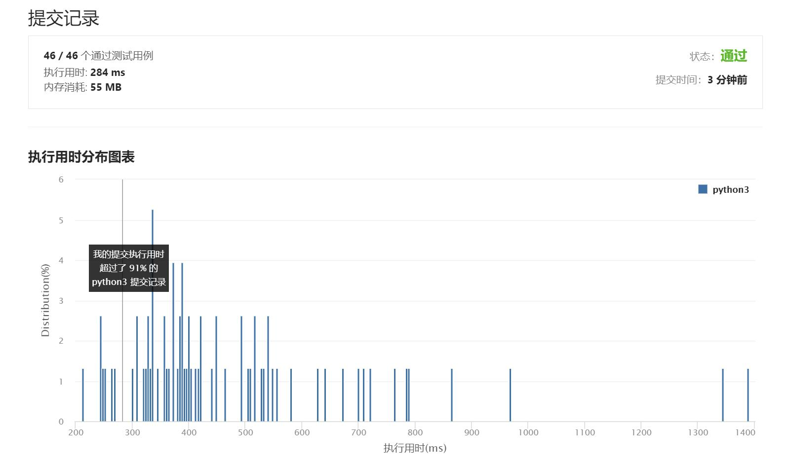

# 1743-从相邻元素对还原数组

Author：_Mumu

创建日期：2021/7/25

通过日期：2021/7/25

*****

踩过的坑：

1. 不知道为什么好像不用`defaultdict`就会超时，迷

已解决：52/2173

*****

难度：中等

问题描述：

存在一个由 n 个不同元素组成的整数数组 nums ，但你已经记不清具体内容。好在你还记得 nums 中的每一对相邻元素。

给你一个二维整数数组 adjacentPairs ，大小为 n - 1 ，其中每个 adjacentPairs[i] = [ui, vi] 表示元素 ui 和 vi 在 nums 中相邻。

题目数据保证所有由元素 nums[i] 和 nums[i+1] 组成的相邻元素对都存在于 adjacentPairs 中，存在形式可能是 [nums[i], nums[i+1]] ，也可能是 [nums[i+1], nums[i]] 。这些相邻元素对可以 按任意顺序 出现。

返回 原始数组 nums 。如果存在多种解答，返回 其中任意一个 即可。

 

示例 1：

输入：adjacentPairs = [[2,1],[3,4],[3,2]]
输出：[1,2,3,4]
解释：数组的所有相邻元素对都在 adjacentPairs 中。
特别要注意的是，adjacentPairs[i] 只表示两个元素相邻，并不保证其 左-右 顺序。
示例 2：

输入：adjacentPairs = [[4,-2],[1,4],[-3,1]]
输出：[-2,4,1,-3]
解释：数组中可能存在负数。
另一种解答是 [-3,1,4,-2] ，也会被视作正确答案。
示例 3：

输入：adjacentPairs = [[100000,-100000]]
输出：[100000,-100000]

提示：

nums.length == n
adjacentPairs.length == n - 1
adjacentPairs[i].length == 2
2 <= n <= 105
-105 <= nums[i], ui, vi <= 105
题目数据保证存在一些以 adjacentPairs 作为元素对的数组 nums

来源：力扣（LeetCode）
链接：https://leetcode-cn.com/problems/restore-the-array-from-adjacent-pairs