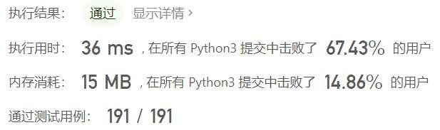
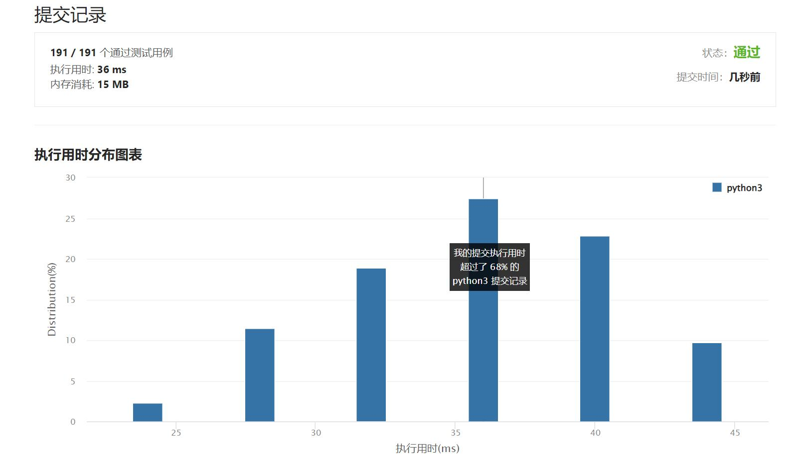

# 1784-检查二进制字符串字段

Author：_Mumu

创建日期：2022/10/03

通过日期：2022/10/03

*****

踩过的坑：

1. 轻松愉快

已解决：480/2801

*****

难度：简单

问题描述：

给你一个二进制字符串 s ，该字符串 不含前导零 。

如果 s 包含 零个或一个由连续的 '1' 组成的字段 ，返回 true 。否则，返回 false 。

如果 s 中 由连续若干个 '1' 组成的字段 数量不超过 1，返回 true 。否则，返回 false 。

 

示例 1：

输入：s = "1001"
输出：false
解释：由连续若干个 '1' 组成的字段数量为 2，返回 false
示例 2：

输入：s = "110"
输出：true

提示：

1 <= s.length <= 100
s[i] 为 '0' 或 '1'
s[0] 为 '1'

来源：力扣（LeetCode）
链接：https://leetcode.cn/problems/check-if-binary-string-has-at-most-one-segment-of-ones