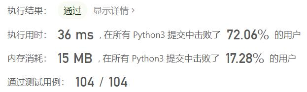
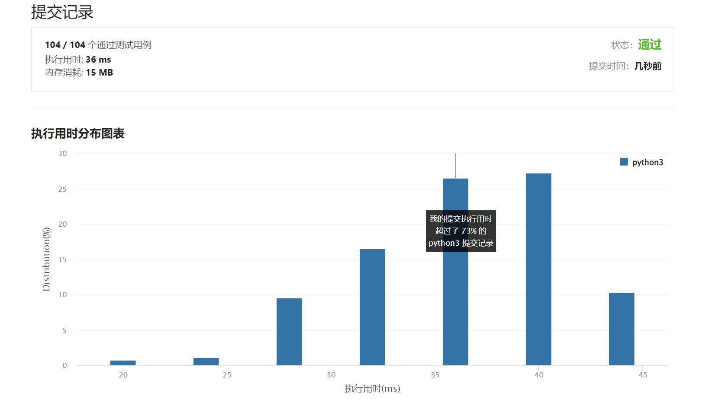

# 1800-最大升序子数组和

Author：_Mumu

创建日期：2022/10/07

通过日期：2022/10/07

*****

踩过的坑：

1. 轻松愉快
1. 开始以为可以是不连续的子序列，那就得dp了至少是个中等题
1. 没想到居然是连续的子串，那真是简单死了

已解决：484/2802

*****

难度：简单

问题描述：

给你一个正整数组成的数组 nums ，返回 nums 中一个 升序 子数组的最大可能元素和。

子数组是数组中的一个连续数字序列。

已知子数组 [numsl, numsl+1, ..., numsr-1, numsr] ，若对所有 i（l <= i < r），numsi < numsi+1 都成立，则称这一子数组为 升序 子数组。注意，大小为 1 的子数组也视作 升序 子数组。

 

示例 1：

输入：nums = [10,20,30,5,10,50]
输出：65
解释：[5,10,50] 是元素和最大的升序子数组，最大元素和为 65 。
示例 2：

输入：nums = [10,20,30,40,50]
输出：150
解释：[10,20,30,40,50] 是元素和最大的升序子数组，最大元素和为 150 。 
示例 3：

输入：nums = [12,17,15,13,10,11,12]
输出：33
解释：[10,11,12] 是元素和最大的升序子数组，最大元素和为 33 。 
示例 4：

输入：nums = [100,10,1]
输出：100

提示：

1 <= nums.length <= 100
1 <= nums[i] <= 100

来源：力扣（LeetCode）
链接：https://leetcode.cn/problems/maximum-ascending-subarray-sum