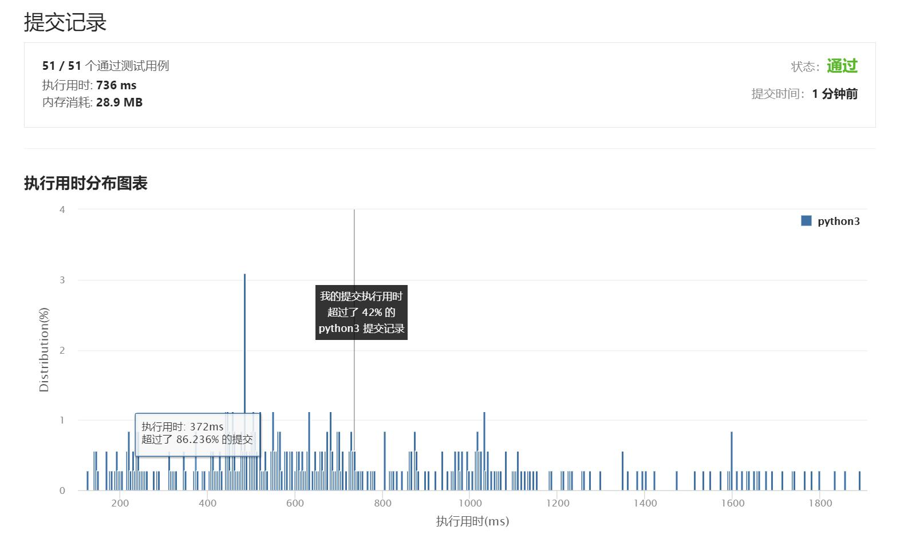

# 1818-绝对差值和

Author：_Mumu

创建日期：2021/7/14

通过日期：2021/7/14

*****

踩过的坑：

1. 嗯...看题解的时候，感觉自己的思路再深挖一点下去，就是题解了，怎么就老是不继续想下去呢
2. 关键在于对nums1的排序，使得二分查找得以成立，剩下的就很容易了
3. 看其他人的写法的时候无意中发现了一个叫bisect的神奇的包（这也太爽了吧，直接一键告别left、right和mid啊）

已解决：41/2157

*****

难度：中等

问题描述：

给你两个正整数数组 nums1 和 nums2 ，数组的长度都是 n 。

数组 nums1 和 nums2 的 绝对差值和 定义为所有 |nums1[i] - nums2[i]|（0 <= i < n）的 总和（下标从 0 开始）。

你可以选用 nums1 中的 任意一个 元素来替换 nums1 中的 至多 一个元素，以 最小化 绝对差值和。

在替换数组 nums1 中最多一个元素 之后 ，返回最小绝对差值和。因为答案可能很大，所以需要对 109 + 7 取余 后返回。

|x| 定义为：

如果 x >= 0 ，值为 x ，或者
如果 x <= 0 ，值为 -x

示例 1：

输入：nums1 = [1,7,5], nums2 = [2,3,5]
输出：3
解释：有两种可能的最优方案：
- 将第二个元素替换为第一个元素：[1,7,5] => [1,1,5] ，或者
- 将第二个元素替换为第三个元素：[1,7,5] => [1,5,5]
两种方案的绝对差值和都是 |1-2| + (|1-3| 或者 |5-3|) + |5-5| = 3
示例 2：

输入：nums1 = [2,4,6,8,10], nums2 = [2,4,6,8,10]
输出：0
解释：nums1 和 nums2 相等，所以不用替换元素。绝对差值和为 0
示例 3：

输入：nums1 = [1,10,4,4,2,7], nums2 = [9,3,5,1,7,4]
输出：20
解释：将第一个元素替换为第二个元素：[1,10,4,4,2,7] => [10,10,4,4,2,7]
绝对差值和为 |10-9| + |10-3| + |4-5| + |4-1| + |2-7| + |7-4| = 20

提示：

n == nums1.length
n == nums2.length
1 <= n <= 105
1 <= nums1[i], nums2[i] <= 105

来源：力扣（LeetCode）
链接：https://leetcode-cn.com/problems/minimum-absolute-sum-difference