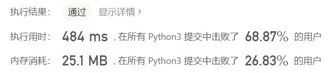
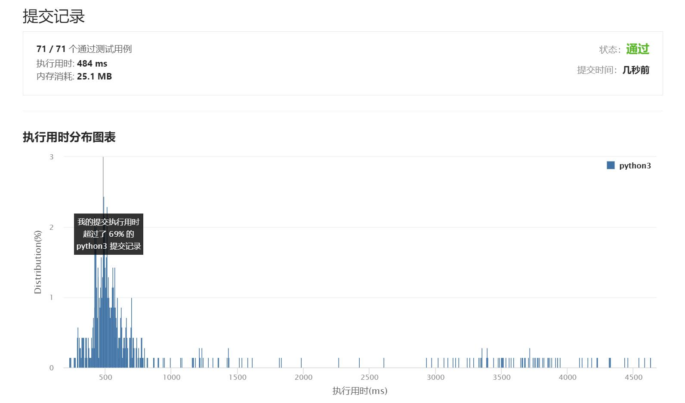

# 1838-最高频元素的频数

Author：_Mumu

创建日期：2021/7/19

通过日期：2021/7/19

*****

踩过的坑：

1. 想不出来咋做啊，难受子
2. 然后一看题解：滑动窗口，顿时豁然开朗，chuachuachua就秒了
3. 我觉得有一些细节我还处理得非常好，比如计算差值的时候使用变化量计算，而不是每次窗口变动就重新计算整个窗口内的结果
4. 有些大佬真的是把内存占用量压缩到极致啊，直接拿变量k来做文章，绝绝

已解决：46/2164

*****

难度：中等

问题描述：

元素的 频数 是该元素在一个数组中出现的次数。

给你一个整数数组 nums 和一个整数 k 。在一步操作中，你可以选择 nums 的一个下标，并将该下标对应元素的值增加 1 。

执行最多 k 次操作后，返回数组中最高频元素的 最大可能频数 。

 

示例 1：

输入：nums = [1,2,4], k = 5
输出：3
解释：对第一个元素执行 3 次递增操作，对第二个元素执 2 次递增操作，此时 nums = [4,4,4] 。
4 是数组中最高频元素，频数是 3 。
示例 2：

输入：nums = [1,4,8,13], k = 5
输出：2
解释：存在多种最优解决方案：
- 对第一个元素执行 3 次递增操作，此时 nums = [4,4,8,13] 。4 是数组中最高频元素，频数是 2 。
- 对第二个元素执行 4 次递增操作，此时 nums = [1,8,8,13] 。8 是数组中最高频元素，频数是 2 。
- 对第三个元素执行 5 次递增操作，此时 nums = [1,4,13,13] 。13 是数组中最高频元素，频数是 2 。
示例 3：

输入：nums = [3,9,6], k = 2
输出：1

提示：

1 <= nums.length <= 105
1 <= nums[i] <= 105
1 <= k <= 105

来源：力扣（LeetCode）
链接：https://leetcode-cn.com/problems/frequency-of-the-most-frequent-element