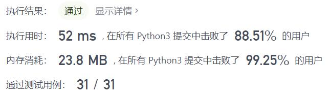
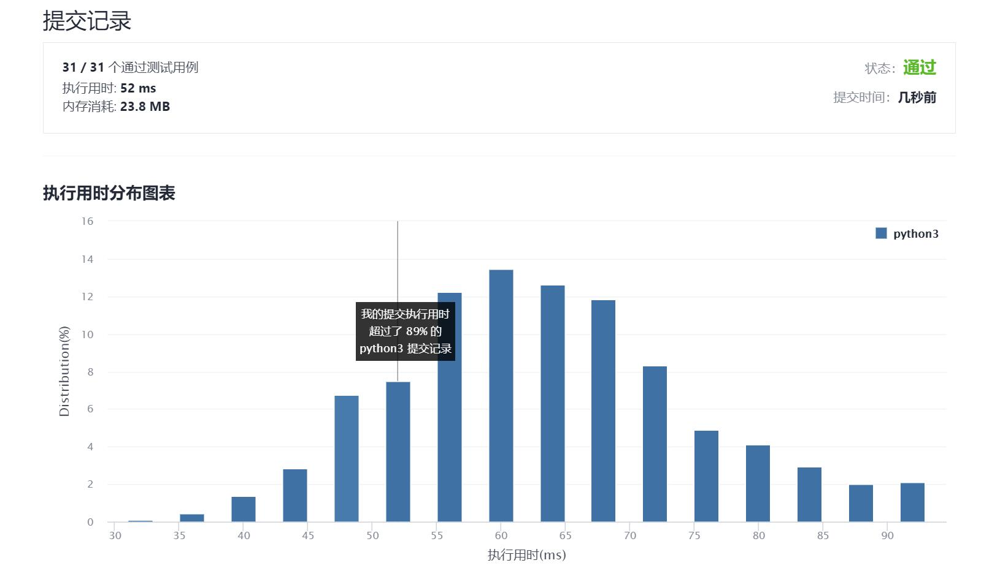

# 187-重复的DNA序列

Author：_Mumu

创建日期：2021/10/8

通过日期：2021/10/8

*****

踩过的坑：

1. `set()`存储出现过的字符串，如果出现过并且不在结果列表直接塞进结果列表
2. 题解巧妙在于利用不同的字符数只有4种，可以用两位二进制数表示所有字符，存储字符串对应的整数减少占用空间，每次直接用新加入的字符更新字符串对应整数减少计算时间

已解决：110/2386

*****

难度：中等

问题描述：

所有 DNA 都由一系列缩写为 'A'，'C'，'G' 和 'T' 的核苷酸组成，例如："ACGAATTCCG"。在研究 DNA 时，识别 DNA 中的重复序列有时会对研究非常有帮助。

编写一个函数来找出所有目标子串，目标子串的长度为 10，且在 DNA 字符串 s 中出现次数超过一次。

 

示例 1：

输入：s = "AAAAACCCCCAAAAACCCCCCAAAAAGGGTTT"
输出：["AAAAACCCCC","CCCCCAAAAA"]
示例 2：

输入：s = "AAAAAAAAAAAAA"
输出：["AAAAAAAAAA"]

提示：

0 <= s.length <= 105
s[i] 为 'A'、'C'、'G' 或 'T'

来源：力扣（LeetCode）
链接：https://leetcode-cn.com/problems/repeated-dna-sequences
