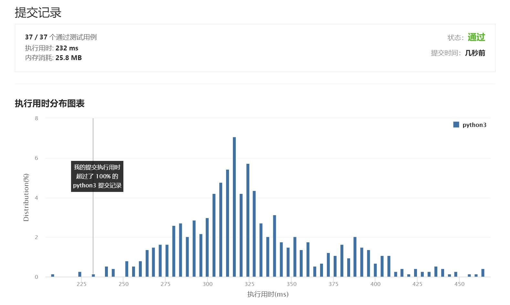

# 1877-数组中最大数对和的最小值

Author：_Mumu

创建日期：2021/7/20

通过日期：2021/7/20

*****

踩过的坑：

1. 难得有题第一反应的思路就是题解啊
2. 明显最大配最小，次大配次小，以此类推，就是符合题意的配对方案
3. 然后再遍历寻找最大和就行了

已解决：47/2164

*****

难度：中等

问题描述：

一个数对 (a,b) 的 数对和 等于 a + b 。最大数对和 是一个数对数组中最大的 数对和 。

比方说，如果我们有数对 (1,5) ，(2,3) 和 (4,4)，最大数对和 为 max(1+5, 2+3, 4+4) = max(6, 5, 8) = 8 。
给你一个长度为 偶数 n 的数组 nums ，请你将 nums 中的元素分成 n / 2 个数对，使得：

nums 中每个元素 恰好 在 一个 数对中，且
最大数对和 的值 最小 。
请你在最优数对划分的方案下，返回最小的 最大数对和 。

 

示例 1：

输入：nums = [3,5,2,3]
输出：7
解释：数组中的元素可以分为数对 (3,3) 和 (5,2) 。
最大数对和为 max(3+3, 5+2) = max(6, 7) = 7 。
示例 2：

输入：nums = [3,5,4,2,4,6]
输出：8
解释：数组中的元素可以分为数对 (3,5)，(4,4) 和 (6,2) 。
最大数对和为 max(3+5, 4+4, 6+2) = max(8, 8, 8) = 8 。

提示：

n == nums.length
2 <= n <= 105
n 是 偶数 。
1 <= nums[i] <= 105

来源：力扣（LeetCode）
链接：https://leetcode-cn.com/problems/minimize-maximum-pair-sum-in-array