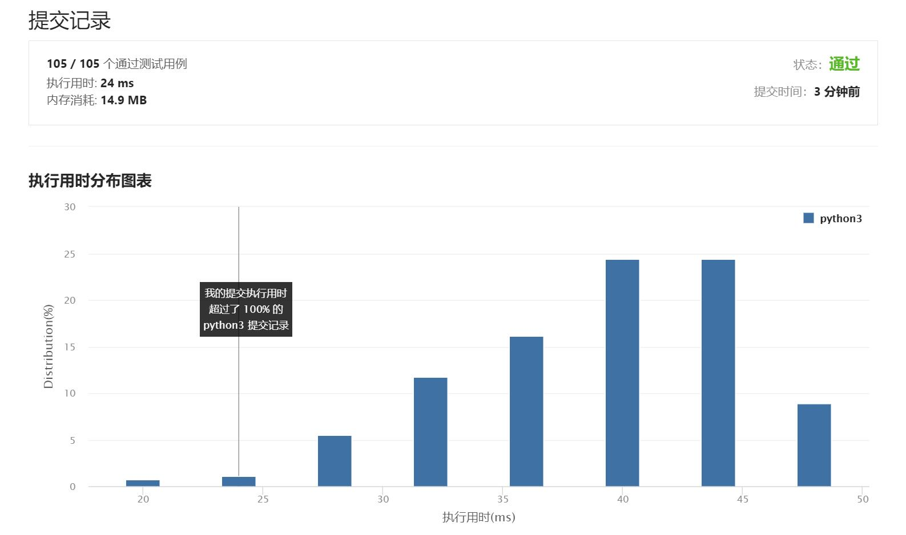

# 1893-检查是否区域内所有整数都被覆盖

Author：_Mumu

创建日期：2021/7/23

通过日期：2021/7/23

*****

踩过的坑：

1. 位运算牛逼！
2. 其实位运算也是类似差分前缀和的方法，但是相比之下不能计算每个区间被覆盖的次数，但是在计算更新上更加简便

已解决：50/2165

*****

难度：简单

问题描述：

给你一个二维整数数组 ranges 和两个整数 left 和 right 。每个 ranges[i] = [starti, endi] 表示一个从 starti 到 endi 的 闭区间 。

如果闭区间 [left, right] 内每个整数都被 ranges 中 至少一个 区间覆盖，那么请你返回 true ，否则返回 false 。

已知区间 ranges[i] = [starti, endi] ，如果整数 x 满足 starti <= x <= endi ，那么我们称整数x 被覆盖了。

 

示例 1：

输入：ranges = [[1,2],[3,4],[5,6]], left = 2, right = 5
输出：true
解释：2 到 5 的每个整数都被覆盖了：
- 2 被第一个区间覆盖。
- 3 和 4 被第二个区间覆盖。
- 5 被第三个区间覆盖。
示例 2：

输入：ranges = [[1,10],[10,20]], left = 21, right = 21
输出：false
解释：21 没有被任何一个区间覆盖。

提示：

1 <= ranges.length <= 50
1 <= starti <= endi <= 50
1 <= left <= right <= 50

来源：力扣（LeetCode）
链接：https://leetcode-cn.com/problems/check-if-all-the-integers-in-a-range-are-covered