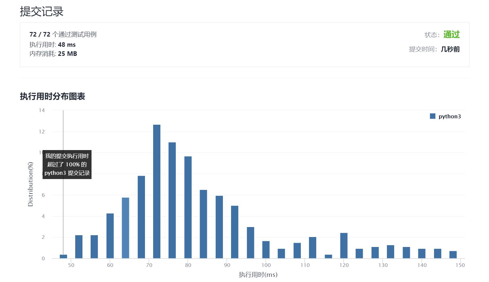

# 1894-找到需要补充粉笔的学生编号

Author：_Mumu

创建日期：2021/9/10

通过日期：2021/9/10

*****

踩过的坑：

1. 感觉我变强了，因为一看题就想到了用前缀和+二分查找来解答
2. 细节上：取$k$模总和的余数，在前缀和数组中进行二分查找，根据题意我们要找的是第一个严格大于余数的位置，所以二分查找使用的是`bisect.bisect()`
3. 不过好笑的是，这题求和取余后线性查找居然比前缀和+二分查找更快，应该是因为尽管二分查找比线性查找更快，内置函数`sum`与计算前缀和相比要快得多，所以对于该题来说，前者反而比后者更快

已解决：86/2342

*****

难度：中等

问题描述：

一个班级里有 n 个学生，编号为 0 到 n - 1 。每个学生会依次回答问题，编号为 0 的学生先回答，然后是编号为 1 的学生，以此类推，直到编号为 n - 1 的学生，然后老师会重复这个过程，重新从编号为 0 的学生开始回答问题。

给你一个长度为 n 且下标从 0 开始的整数数组 chalk 和一个整数 k 。一开始粉笔盒里总共有 k 支粉笔。当编号为 i 的学生回答问题时，他会消耗 chalk[i] 支粉笔。如果剩余粉笔数量 严格小于 chalk[i] ，那么学生 i 需要 补充 粉笔。

请你返回需要 补充 粉笔的学生 编号 。

 

示例 1：

输入：chalk = [5,1,5], k = 22
输出：0
解释：学生消耗粉笔情况如下：
- 编号为 0 的学生使用 5 支粉笔，然后 k = 17 。
- 编号为 1 的学生使用 1 支粉笔，然后 k = 16 。
- 编号为 2 的学生使用 5 支粉笔，然后 k = 11 。
- 编号为 0 的学生使用 5 支粉笔，然后 k = 6 。
- 编号为 1 的学生使用 1 支粉笔，然后 k = 5 。
- 编号为 2 的学生使用 5 支粉笔，然后 k = 0 。
编号为 0 的学生没有足够的粉笔，所以他需要补充粉笔。
示例 2：

输入：chalk = [3,4,1,2], k = 25
输出：1
解释：学生消耗粉笔情况如下：
- 编号为 0 的学生使用 3 支粉笔，然后 k = 22 。
- 编号为 1 的学生使用 4 支粉笔，然后 k = 18 。
- 编号为 2 的学生使用 1 支粉笔，然后 k = 17 。
- 编号为 3 的学生使用 2 支粉笔，然后 k = 15 。
- 编号为 0 的学生使用 3 支粉笔，然后 k = 12 。
- 编号为 1 的学生使用 4 支粉笔，然后 k = 8 。
- 编号为 2 的学生使用 1 支粉笔，然后 k = 7 。
- 编号为 3 的学生使用 2 支粉笔，然后 k = 5 。
- 编号为 0 的学生使用 3 支粉笔，然后 k = 2 。
编号为 1 的学生没有足够的粉笔，所以他需要补充粉笔。

提示：

chalk.length == n
1 <= n <= 105
1 <= chalk[i] <= 105
1 <= k <= 109

来源：力扣（LeetCode）
链接：https://leetcode-cn.com/problems/find-the-student-that-will-replace-the-chalk
