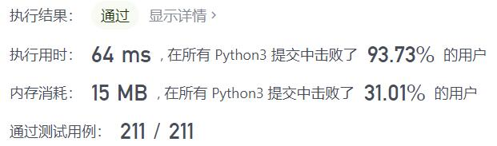
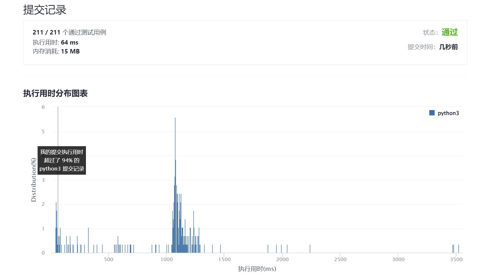

# 1995-统计特殊四元组

Author：_Mumu

创建日期：2021/12/29

通过日期：2021/12/29

*****

踩过的坑：

1. 啊这，一开始错解题意了，没注意到要求$a<b<c<d$
2. 题解哈希计数的思路太牛逼了，直接把暴力$O(n^4)$降为$O(n^2)$，学习了

已解决：191/2477

*****

难度：简单

问题描述：

给你一个 下标从 0 开始 的整数数组 nums ，返回满足下述条件的 不同 四元组 (a, b, c, d) 的 数目 ：

nums[a] + nums[b] + nums[c] == nums[d] ，且
a < b < c < d

示例 1：

输入：nums = [1,2,3,6]
输出：1
解释：满足要求的唯一一个四元组是 (0, 1, 2, 3) 因为 1 + 2 + 3 == 6 。
示例 2：

输入：nums = [3,3,6,4,5]
输出：0
解释：[3,3,6,4,5] 中不存在满足要求的四元组。
示例 3：

输入：nums = [1,1,1,3,5]
输出：4
解释：满足要求的 4 个四元组如下：
- (0, 1, 2, 3): 1 + 1 + 1 == 3
- (0, 1, 3, 4): 1 + 1 + 3 == 5
- (0, 2, 3, 4): 1 + 1 + 3 == 5
- (1, 2, 3, 4): 1 + 1 + 3 == 5

提示：

4 <= nums.length <= 50
1 <= nums[i] <= 100

来源：力扣（LeetCode）
链接：https://leetcode-cn.com/problems/count-special-quadruplets
