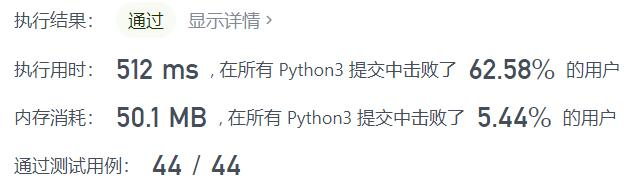
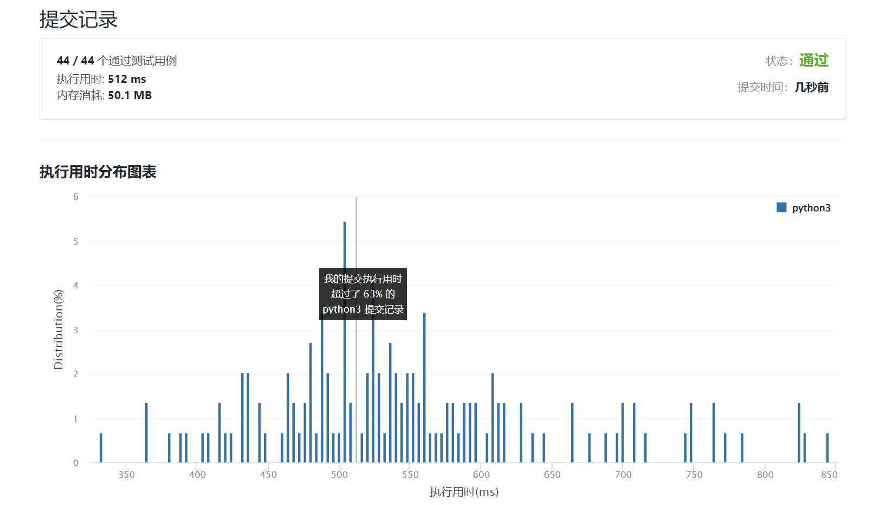

# 1996-游戏中弱角色的数量

Author：_Mumu

创建日期：2022/01/28

通过日期：2022/01/28

*****

踩过的坑：

1. 排序排序，牛啊，攻击力从大到小，防御力从小到大，那么只需要比较已遍历过的最大防御力和当前防御力即可，遍历一遍完事

已解决：235/2507

*****

难度：中等

问题描述：

你正在参加一个多角色游戏，每个角色都有两个主要属性：攻击 和 防御 。给你一个二维整数数组 properties ，其中 properties[i] = [attacki, defensei] 表示游戏中第 i 个角色的属性。

如果存在一个其他角色的攻击和防御等级 都严格高于 该角色的攻击和防御等级，则认为该角色为 弱角色 。更正式地，如果认为角色 i 弱于 存在的另一个角色 j ，那么 attackj > attacki 且 defensej > defensei 。

返回 弱角色 的数量。

 

示例 1：

输入：properties = [[5,5],[6,3],[3,6]]
输出：0
解释：不存在攻击和防御都严格高于其他角色的角色。
示例 2：

输入：properties = [[2,2],[3,3]]
输出：1
解释：第一个角色是弱角色，因为第二个角色的攻击和防御严格大于该角色。
示例 3：

输入：properties = [[1,5],[10,4],[4,3]]
输出：1
解释：第三个角色是弱角色，因为第二个角色的攻击和防御严格大于该角色。

提示：

2 <= properties.length <= 105
properties[i].length == 2
1 <= attacki, defensei <= 105

来源：力扣（LeetCode）
链接：https://leetcode-cn.com/problems/the-number-of-weak-characters-in-the-game
