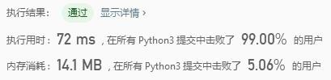
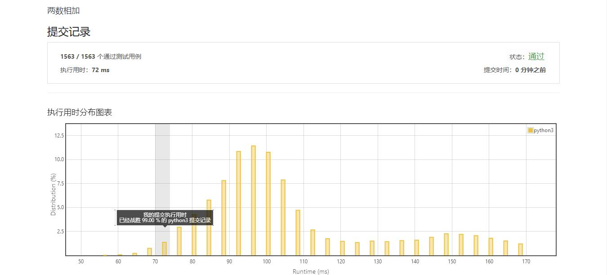

# 2-两数相加

Author：_Mumu

创建日期：2019/10/12

通过日期：2019/10/12

*****

踩过的坑：

1. 注意一下给定列表一定非空，所以不用判断空列表了
2. 只踩到了一个坑：一开始就考虑到了不同长短数字相加与进位的问题，但没有考虑到相同长度数字相加，最高位加后还需要进位的问题
3. 最快的算法写得比我优美多了，sigh

已解决：6/1189

*****

难度：中等

问题描述：

给出两个 非空 的链表用来表示两个非负的整数。其中，它们各自的位数是按照 逆序 的方式存储的，并且它们的每个节点只能存储 一位 数字。

如果，我们将这两个数相加起来，则会返回一个新的链表来表示它们的和。

您可以假设除了数字 0 之外，这两个数都不会以 0 开头。

示例：

输入：(2 -> 4 -> 3) + (5 -> 6 -> 4)

输出：7 -> 0 -> 8

原因：342 + 465 = 807

来源：力扣（LeetCode）
链接：https://leetcode-cn.com/problems/add-two-numbers