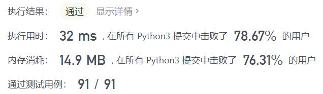
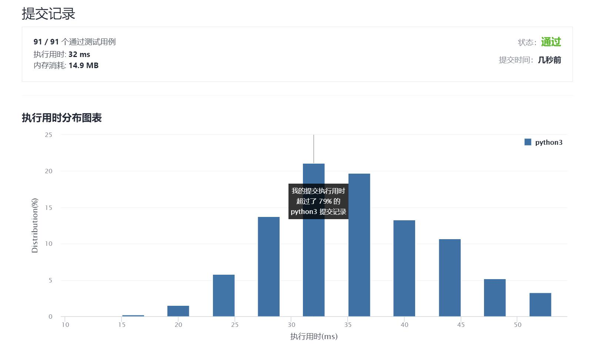

# 20-有效的括号

Author：_Mumu

创建日期：2021/9/6

通过日期：2021/9/6

*****

踩过的坑：

1. 很容易，括号用栈就可以啦
2. 不过没有想到奇数的情况可以一开始直接排除

已解决：81/2342

*****

难度：简单

问题描述：

给定一个只包括 '('，')'，'{'，'}'，'['，']' 的字符串 s ，判断字符串是否有效。

有效字符串需满足：

左括号必须用相同类型的右括号闭合。
左括号必须以正确的顺序闭合。

示例 1：

输入：s = "()"
输出：true
示例 2：

输入：s = "()[]{}"
输出：true
示例 3：

输入：s = "(]"
输出：false
示例 4：

输入：s = "([)]"
输出：false
示例 5：

输入：s = "{[]}"
输出：true

提示：

1 <= s.length <= 104
s 仅由括号 '()[]{}' 组成

来源：力扣（LeetCode）
链接：https://leetcode-cn.com/problems/valid-parentheses
