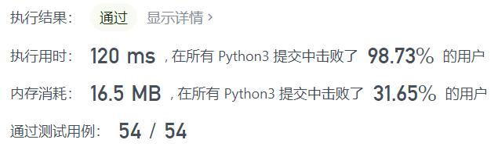
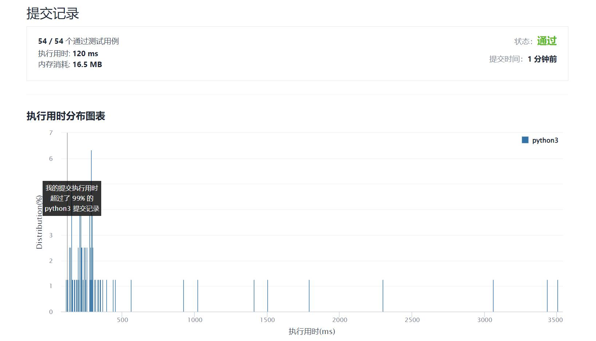

# 2013-检测正方形

Author：_Mumu

创建日期：2022/01/26

通过日期：2022/01/26

*****

踩过的坑：

1. 香啊，哈希表查询是真的香啊
2. 点是肯定要存的，问题是在于怎么存
3. 想充分发挥哈希表查询的优势，一开始想的是$x$为键$y$组成的列表为值存一个表，同时再反向$y$为键再存一个表，这样就能横纵坐标互相查找了
4. 然后想了一下好像没有必要多存一个表，算出边长后可以直接算另一个横坐标再次直接查找
5. 然后又想列表查找太费时了，集合又没法表达数量信息，那索性嵌套个字典，键为$y$值为该点在数据流中被添加的次数
6. 那么一切就通顺了
7. 假设给定基准点是$(x,y)$​，因为要求的是轴对齐正方形，那么只需要对表中横坐标键$x$​对应的子表纵坐标键$y_1$​​遍历，跳过$y_1=y$​，令$e=\left|y_1-y\right|$​，分别考虑$x_1=x+e$​和$x_1=x-e$，检查$x_1$是否在表中且$y$和$y_1$​是否在其对应的子表中，若都存在，那么一共能组成的正方形个数是`points[x][y1] * points[x1][y] * points[x1][y1]`，将该值加入答案即可​
8. 嗯。。然后看题解发现，根据对称性$e$可以不用取绝对值。。
9. 不想用题解的defaultdict和Counter主要是因为这俩貌似在处理不存在的数据时会把它加入并赋个默认值，会影响内存占用好像

已解决：233/2506

*****

难度：中等

问题描述：

给你一个在 X-Y 平面上的点构成的数据流。设计一个满足下述要求的算法：

添加 一个在数据流中的新点到某个数据结构中。可以添加 重复 的点，并会视作不同的点进行处理。
给你一个查询点，请你从数据结构中选出三个点，使这三个点和查询点一同构成一个 面积为正 的 轴对齐正方形 ，统计 满足该要求的方案数目。
轴对齐正方形 是一个正方形，除四条边长度相同外，还满足每条边都与 x-轴 或 y-轴 平行或垂直。

实现 DetectSquares 类：

DetectSquares() 使用空数据结构初始化对象
void add(int[] point) 向数据结构添加一个新的点 point = [x, y]
int count(int[] point) 统计按上述方式与点 point = [x, y] 共同构造 轴对齐正方形 的方案数。

示例：

输入：
["DetectSquares", "add", "add", "add", "count", "count", "add", "count"]
[[], [[3, 10]], [[11, 2]], [[3, 2]], [[11, 10]], [[14, 8]], [[11, 2]], [[11, 10]]]
输出：
[null, null, null, null, 1, 0, null, 2]

解释：
DetectSquares detectSquares = new DetectSquares();
detectSquares.add([3, 10]);
detectSquares.add([11, 2]);
detectSquares.add([3, 2]);
detectSquares.count([11, 10]); // 返回 1 。你可以选择：
                               //   - 第一个，第二个，和第三个点
detectSquares.count([14, 8]);  // 返回 0 。查询点无法与数据结构中的这些点构成正方形。
detectSquares.add([11, 2]);    // 允许添加重复的点。
detectSquares.count([11, 10]); // 返回 2 。你可以选择：
                               //   - 第一个，第二个，和第三个点
                               //   - 第一个，第三个，和第四个点

提示：

point.length == 2
0 <= x, y <= 1000
调用 add 和 count 的 总次数 最多为 5000

来源：力扣（LeetCode）
链接：https://leetcode-cn.com/problems/detect-squares
