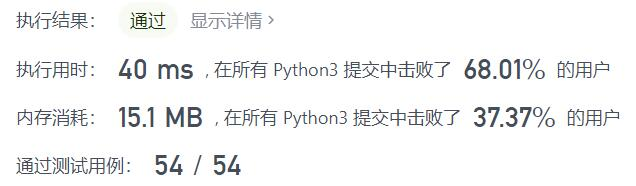
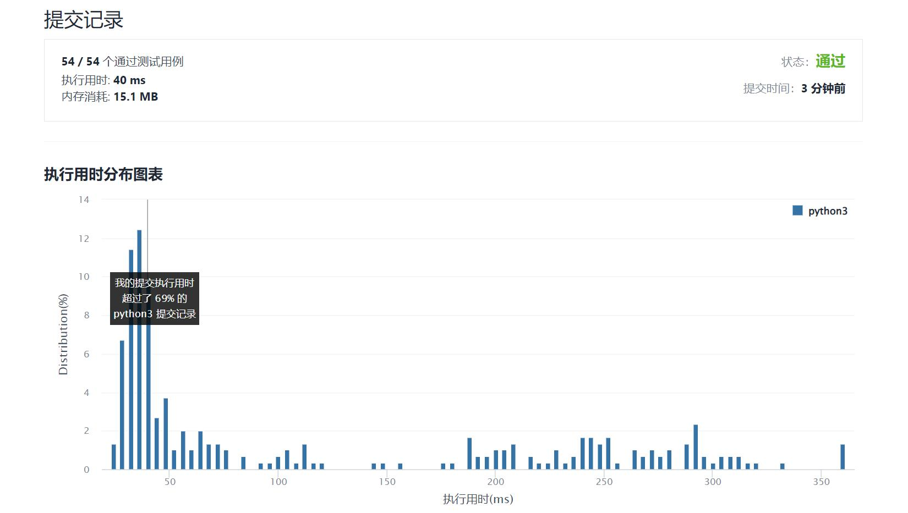

# 2016-增量元素之间的最大差值

Author：_Mumu

创建日期：2022/02/26

通过日期：2022/02/26

*****

踩过的坑：

1. 轻松愉快
2. 第一反应暴力，第二反应想起来好像可以一次遍历解决，记录当前最小值即可，即题解所说前缀最小值

已解决：262/2539

*****

难度：简单

问题描述：

给你一个下标从 0 开始的整数数组 nums ，该数组的大小为 n ，请你计算 nums[j] - nums[i] 能求得的 最大差值 ，其中 0 <= i < j < n 且 nums[i] < nums[j] 。

返回 最大差值 。如果不存在满足要求的 i 和 j ，返回 -1 。

 

示例 1：

输入：nums = [7,1,5,4]
输出：4
解释：
最大差值出现在 i = 1 且 j = 2 时，nums[j] - nums[i] = 5 - 1 = 4 。
注意，尽管 i = 1 且 j = 0 时 ，nums[j] - nums[i] = 7 - 1 = 6 > 4 ，但 i > j 不满足题面要求，所以 6 不是有效的答案。
示例 2：

输入：nums = [9,4,3,2]
输出：-1
解释：
不存在同时满足 i < j 和 nums[i] < nums[j] 这两个条件的 i, j 组合。
示例 3：

输入：nums = [1,5,2,10]
输出：9
解释：
最大差值出现在 i = 0 且 j = 3 时，nums[j] - nums[i] = 10 - 1 = 9 。

提示：

n == nums.length
2 <= n <= 1000
1 <= nums[i] <= 109

来源：力扣（LeetCode）
链接：https://leetcode-cn.com/problems/maximum-difference-between-increasing-elements