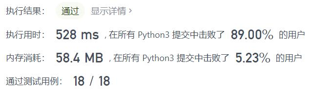
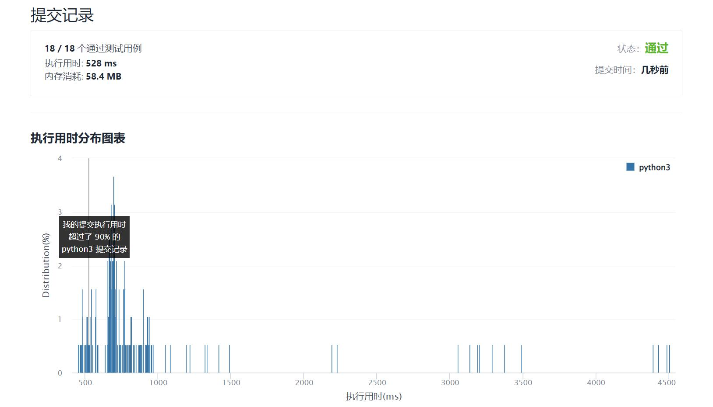

# 2034-股票价格波动

Author：_Mumu

创建日期：2022/01/23

通过日期：2022/01/23

*****

踩过的坑：

1. 草，知道该用堆了，但是只想着每次更新的时候把堆的错误值更新，每一次更新错误值都是$O(n)$，这导致如果更新和出错次数太多，时间会爆
2. 没想到堆中错误值不必更新，而是把时间戳一起存入，只需要取出最大最小股价时验证一下是否被修改过即可，验证一次最差是$O(n)$，但验证一次就把错误值删除了就不必再验证了

已解决：230/2502

*****

难度：中等

问题描述：

给你一支股票价格的数据流。数据流中每一条记录包含一个 时间戳 和该时间点股票对应的 价格 。

不巧的是，由于股票市场内在的波动性，股票价格记录可能不是按时间顺序到来的。某些情况下，有的记录可能是错的。如果两个有相同时间戳的记录出现在数据流中，前一条记录视为错误记录，后出现的记录 更正 前一条错误的记录。

请你设计一个算法，实现：

更新 股票在某一时间戳的股票价格，如果有之前同一时间戳的价格，这一操作将 更正 之前的错误价格。
找到当前记录里 最新股票价格 。最新股票价格 定义为时间戳最晚的股票价格。
找到当前记录里股票的 最高价格 。
找到当前记录里股票的 最低价格 。
请你实现 StockPrice 类：

StockPrice() 初始化对象，当前无股票价格记录。
void update(int timestamp, int price) 在时间点 timestamp 更新股票价格为 price 。
int current() 返回股票 最新价格 。
int maximum() 返回股票 最高价格 。
int minimum() 返回股票 最低价格 。

示例 1：

输入：
["StockPrice", "update", "update", "current", "maximum", "update", "maximum", "update", "minimum"]
[[], [1, 10], [2, 5], [], [], [1, 3], [], [4, 2], []]
输出：
[null, null, null, 5, 10, null, 5, null, 2]

解释：
StockPrice stockPrice = new StockPrice();
stockPrice.update(1, 10); // 时间戳为 [1] ，对应的股票价格为 [10] 。
stockPrice.update(2, 5);  // 时间戳为 [1,2] ，对应的股票价格为 [10,5] 。
stockPrice.current();     // 返回 5 ，最新时间戳为 2 ，对应价格为 5 。
stockPrice.maximum();     // 返回 10 ，最高价格的时间戳为 1 ，价格为 10 。
stockPrice.update(1, 3);  // 之前时间戳为 1 的价格错误，价格更新为 3 。
                          // 时间戳为 [1,2] ，对应股票价格为 [3,5] 。
stockPrice.maximum();     // 返回 5 ，更正后最高价格为 5 。
stockPrice.update(4, 2);  // 时间戳为 [1,2,4] ，对应价格为 [3,5,2] 。
stockPrice.minimum();     // 返回 2 ，最低价格时间戳为 4 ，价格为 2 。

提示：

1 <= timestamp, price <= 109
update，current，maximum 和 minimum 总 调用次数不超过 105 。
current，maximum 和 minimum 被调用时，update 操作 至少 已经被调用过 一次 。

来源：力扣（LeetCode）
链接：https://leetcode-cn.com/problems/stock-price-fluctuation
