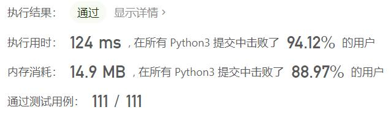
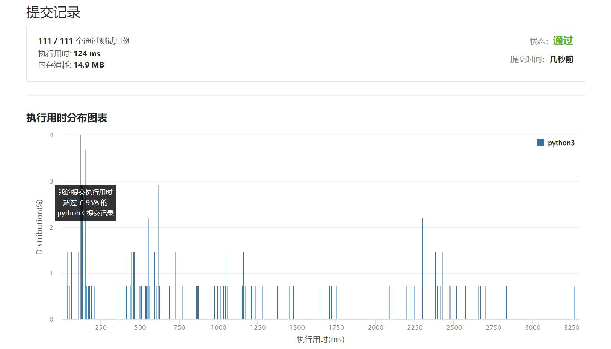

# 2044-统计按位或能得到最大值的子集数目

Author：_Mumu

创建日期：2022/03/15

通过日期：2022/03/15

*****

踩过的坑：

1. 一题四解逐层优化的大佬也太强了
1. 基础思路还是先计算出所有数字或的结果，然后使用dfs，每一个数字都有选和不选两种情况
1. 优化思路就是dfs的剪枝，一是现在的或值达到或的结果后说明之后所有元素选和不选都一样能加入答案，所以直接计算总数加入，不必在逐个演算；二是，因为不选对计算并没有帮助，所以不必逐步验算不选，而是直接跳着选，相当于计算了中间的数都不选的情况

已解决：279/2558

*****

难度：中等

问题描述：

给你一个整数数组 nums ，请你找出 nums 子集 按位或 可能得到的 最大值 ，并返回按位或能得到最大值的 不同非空子集的数目 。

如果数组 a 可以由数组 b 删除一些元素（或不删除）得到，则认为数组 a 是数组 b 的一个 子集 。如果选中的元素下标位置不一样，则认为两个子集 不同 。

对数组 a 执行 按位或 ，结果等于 a[0] OR a[1] OR ... OR a[a.length - 1]（下标从 0 开始）。

 

示例 1：

输入：nums = [3,1]
输出：2
解释：子集按位或能得到的最大值是 3 。有 2 个子集按位或可以得到 3 ：
- [3]
- [3,1]
示例 2：

输入：nums = [2,2,2]
输出：7
解释：[2,2,2] 的所有非空子集的按位或都可以得到 2 。总共有 23 - 1 = 7 个子集。
示例 3：

输入：nums = [3,2,1,5]
输出：6
解释：子集按位或可能的最大值是 7 。有 6 个子集按位或可以得到 7 ：
- [3,5]
- [3,1,5]
- [3,2,5]
- [3,2,1,5]
- [2,5]
- [2,1,5]

提示：

1 <= nums.length <= 16
1 <= nums[i] <= 105

来源：力扣（LeetCode）
链接：https://leetcode-cn.com/problems/count-number-of-maximum-bitwise-or-subsets