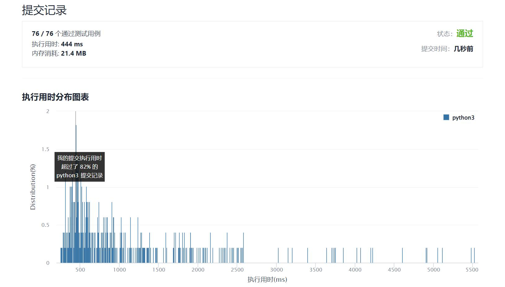

# 2045-到达目的地的第二短时间

Author：_Mumu

创建日期：2022/01/24

通过日期：2022/01/24

*****

踩过的坑：

1. 呜呜，遇到困难睡大觉，被时间和红绿灯搞迷糊了，没想到只要求第二长的路径就好了

已解决：231/2506

*****

难度：困难

问题描述：

城市用一个 双向连通 图表示，图中有 n 个节点，从 1 到 n 编号（包含 1 和 n）。图中的边用一个二维整数数组 edges 表示，其中每个 edges[i] = [ui, vi] 表示一条节点 ui 和节点 vi 之间的双向连通边。每组节点对由 最多一条 边连通，顶点不存在连接到自身的边。穿过任意一条边的时间是 time 分钟。

每个节点都有一个交通信号灯，每 change 分钟改变一次，从绿色变成红色，再由红色变成绿色，循环往复。所有信号灯都 同时 改变。你可以在 任何时候 进入某个节点，但是 只能 在节点 信号灯是绿色时 才能离开。如果信号灯是  绿色 ，你 不能 在节点等待，必须离开。

第二小的值 是 严格大于 最小值的所有值中最小的值。

例如，[2, 3, 4] 中第二小的值是 3 ，而 [2, 2, 4] 中第二小的值是 4 。
给你 n、edges、time 和 change ，返回从节点 1 到节点 n 需要的 第二短时间 。

注意：

你可以 任意次 穿过任意顶点，包括 1 和 n 。
你可以假设在 启程时 ，所有信号灯刚刚变成 绿色 。

示例 1：

        

输入：n = 5, edges = [[1,2],[1,3],[1,4],[3,4],[4,5]], time = 3, change = 5
输出：13
解释：
上面的左图展现了给出的城市交通图。
右图中的蓝色路径是最短时间路径。
花费的时间是：
- 从节点 1 开始，总花费时间=0
- 1 -> 4：3 分钟，总花费时间=3
- 4 -> 5：3 分钟，总花费时间=6
因此需要的最小时间是 6 分钟。

右图中的红色路径是第二短时间路径。
- 从节点 1 开始，总花费时间=0
- 1 -> 3：3 分钟，总花费时间=3
- 3 -> 4：3 分钟，总花费时间=6
- 在节点 4 等待 4 分钟，总花费时间=10
- 4 -> 5：3 分钟，总花费时间=13
因此第二短时间是 13 分钟。      
示例 2：

输入：n = 2, edges = [[1,2]], time = 3, change = 2
输出：11
解释：
最短时间路径是 1 -> 2 ，总花费时间 = 3 分钟
最短时间路径是 1 -> 2 -> 1 -> 2 ，总花费时间 = 11 分钟

提示：

2 <= n <= 104
n - 1 <= edges.length <= min(2 * 104, n * (n - 1) / 2)
edges[i].length == 2
1 <= ui, vi <= n
ui != vi
不含重复边
每个节点都可以从其他节点直接或者间接到达
1 <= time, change <= 103

来源：力扣（LeetCode）
链接：https://leetcode-cn.com/problems/second-minimum-time-to-reach-destination
