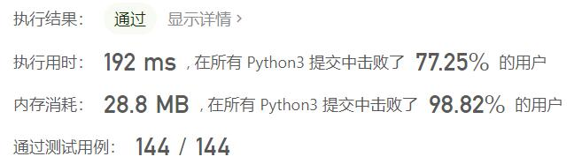
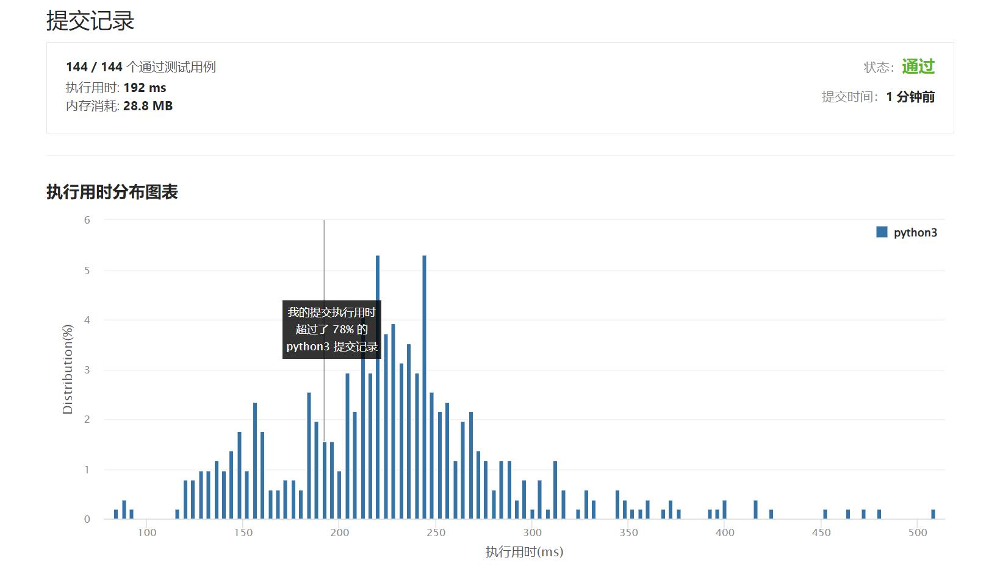

# 2100-适合打劫银行的日子

Author：_Mumu

创建日期：2022/03/06

通过日期：2022/03/06

*****

踩过的坑：

1. 轻松愉快
2. 思路是滑动窗口，也可以说是动态规划，遍历满足前后都有$time$天的日子，假设遍历到第$i$天，用$left_i$记录截至当天的最长安保人数非递增序列长度，$left_i=time$则表示第$i$天前$time$天都满足此条件，同样，用$right$记录截至第$i+time$天的最长安保人数非递减序列长度，$right_i=time$则表示第$i$天后$time$天都满足此条件
2. 递推时，若满足第$i+1$天安保人数小于等于第$i$天的，则$left_{i+1}=\min\{time,left_i+1\}$，不满足时$left_{i+1}=0$；$right$的递推关系是类似的
2. 当且仅当$left_i=right_i=time$时将$i$加入答案列表

已解决：270/2552

*****

难度：中等

问题描述：

你和一群强盗准备打劫银行。给你一个下标从 0 开始的整数数组 security ，其中 security[i] 是第 i 天执勤警卫的数量。日子从 0 开始编号。同时给你一个整数 time 。

如果第 i 天满足以下所有条件，我们称它为一个适合打劫银行的日子：

第 i 天前和后都分别至少有 time 天。
第 i 天前连续 time 天警卫数目都是非递增的。
第 i 天后连续 time 天警卫数目都是非递减的。
更正式的，第 i 天是一个合适打劫银行的日子当且仅当：security[i - time] >= security[i - time + 1] >= ... >= security[i] <= ... <= security[i + time - 1] <= security[i + time].

请你返回一个数组，包含 所有 适合打劫银行的日子（下标从 0 开始）。返回的日子可以 任意 顺序排列。

 

示例 1：

输入：security = [5,3,3,3,5,6,2], time = 2
输出：[2,3]
解释：
第 2 天，我们有 security[0] >= security[1] >= security[2] <= security[3] <= security[4] 。
第 3 天，我们有 security[1] >= security[2] >= security[3] <= security[4] <= security[5] 。
没有其他日子符合这个条件，所以日子 2 和 3 是适合打劫银行的日子。
示例 2：

输入：security = [1,1,1,1,1], time = 0
输出：[0,1,2,3,4]
解释：
因为 time 等于 0 ，所以每一天都是适合打劫银行的日子，所以返回每一天。
示例 3：

输入：security = [1,2,3,4,5,6], time = 2
输出：[]
解释：
没有任何一天的前 2 天警卫数目是非递增的。
所以没有适合打劫银行的日子，返回空数组。
示例 4：

输入：security = [1], time = 5
输出：[]
解释：
没有日子前面和后面有 5 天时间。
所以没有适合打劫银行的日子，返回空数组。

提示：

1 <= security.length <= 105
0 <= security[i], time <= 105

来源：力扣（LeetCode）
链接：https://leetcode-cn.com/problems/find-good-days-to-rob-the-bank