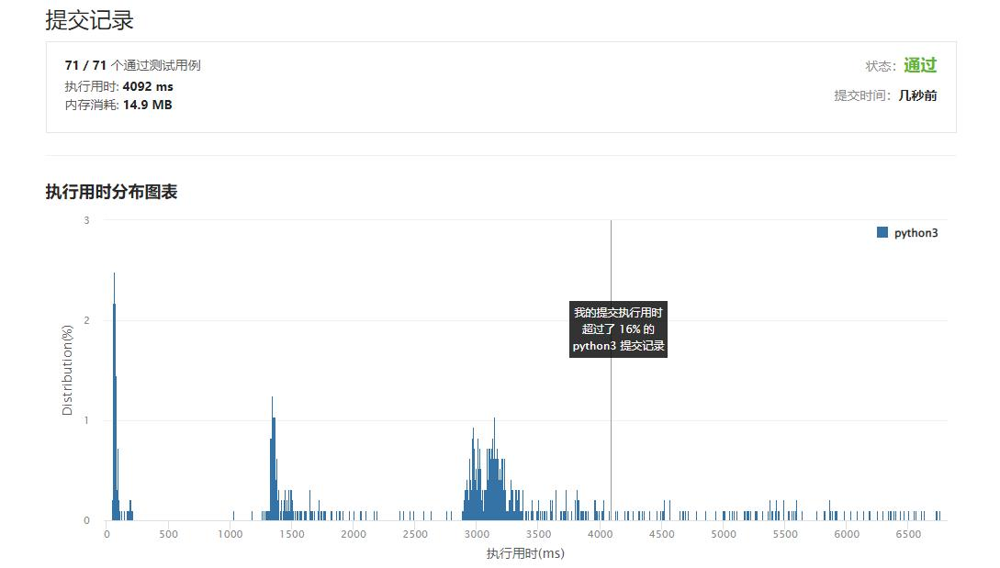

# 2104-子数组范围和

Author：_Mumu

创建日期：2022/03/04

通过日期：2022/03/04

*****

踩过的坑：

1. 轻松愉快
2. 单调栈我选择太长不看，上班了上班了

已解决：268/2544

*****

难度：中等

问题描述：

给你一个整数数组 nums 。nums 中，子数组的 范围 是子数组中最大元素和最小元素的差值。

返回 nums 中 所有 子数组范围的 和 。

子数组是数组中一个连续 非空 的元素序列。

 

示例 1：

输入：nums = [1,2,3]
输出：4
解释：nums 的 6 个子数组如下所示：
[1]，范围 = 最大 - 最小 = 1 - 1 = 0 
[2]，范围 = 2 - 2 = 0
[3]，范围 = 3 - 3 = 0
[1,2]，范围 = 2 - 1 = 1
[2,3]，范围 = 3 - 2 = 1
[1,2,3]，范围 = 3 - 1 = 2
所有范围的和是 0 + 0 + 0 + 1 + 1 + 2 = 4
示例 2：

输入：nums = [1,3,3]
输出：4
解释：nums 的 6 个子数组如下所示：
[1]，范围 = 最大 - 最小 = 1 - 1 = 0
[3]，范围 = 3 - 3 = 0
[3]，范围 = 3 - 3 = 0
[1,3]，范围 = 3 - 1 = 2
[3,3]，范围 = 3 - 3 = 0
[1,3,3]，范围 = 3 - 1 = 2
所有范围的和是 0 + 0 + 0 + 2 + 0 + 2 = 4
示例 3：

输入：nums = [4,-2,-3,4,1]
输出：59
解释：nums 中所有子数组范围的和是 59

提示：

1 <= nums.length <= 1000
-109 <= nums[i] <= 109

进阶：你可以设计一种时间复杂度为 O(n) 的解决方案吗？

来源：力扣（LeetCode）
链接：https://leetcode-cn.com/problems/sum-of-subarray-ranges