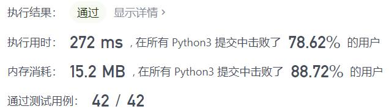
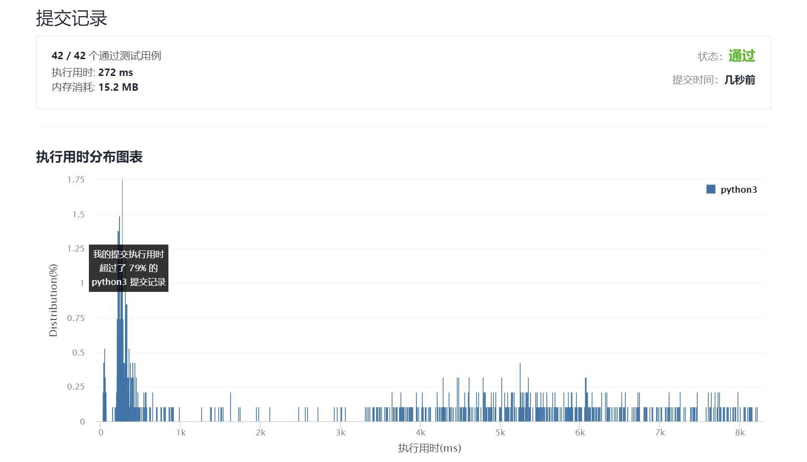

# 212-单词搜索II

Author：_Mumu

创建日期：2021/9/16

通过日期：2021/9/16

*****

踩过的坑：

1. 好难啊，只能说看着题解思路以及代码慢慢一点一点复现的
2. 为了用字典树，特地先去做了208来学习怎么写字典树，还是很牛逼的

已解决：92/2354

*****

难度：困难

问题描述：

给定一个 m x n 二维字符网格 board 和一个单词（字符串）列表 words，找出所有同时在二维网格和字典中出现的单词。

单词必须按照字母顺序，通过 相邻的单元格 内的字母构成，其中“相邻”单元格是那些水平相邻或垂直相邻的单元格。同一个单元格内的字母在一个单词中不允许被重复使用。

 

示例 1：

输入：board = [["o","a","a","n"],["e","t","a","e"],["i","h","k","r"],["i","f","l","v"]], words = ["oath","pea","eat","rain"]
输出：["eat","oath"]
示例 2：

输入：board = [["a","b"],["c","d"]], words = ["abcb"]
输出：[]

提示：

m == board.length
n == board[i].length
1 <= m, n <= 12
board[i][j] 是一个小写英文字母
1 <= words.length <= 3 * 104
1 <= words[i].length <= 10
words[i] 由小写英文字母组成
words 中的所有字符串互不相同

来源：力扣（LeetCode）
链接：https://leetcode-cn.com/problems/word-search-ii
