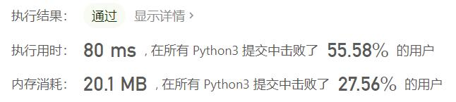
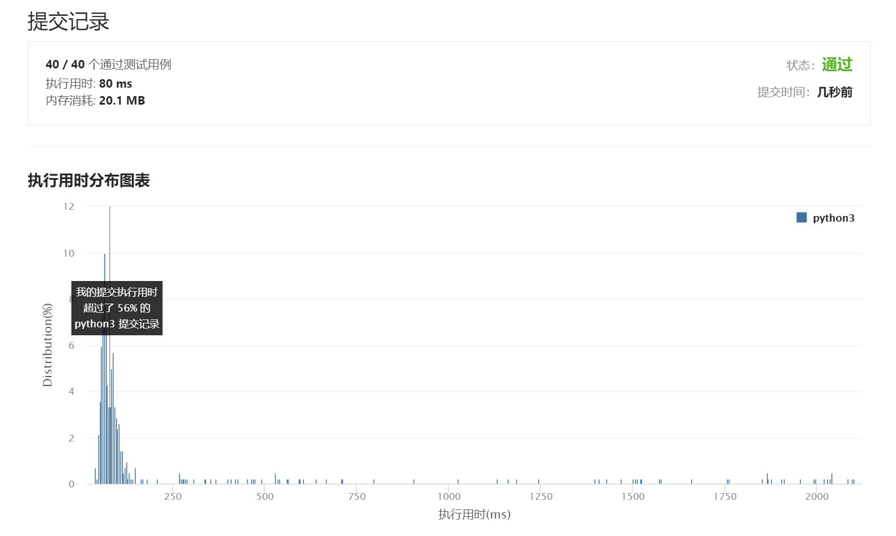

# 218-天际线问题

Author：_Mumu

创建日期：2021/7/13

通过日期：2021/7/13

*****

踩过的坑：

1. 太难了太难了太难了，就当是学习了
2. 只能想到暴力解法，也就是扫描最大坐标和最小坐标的每个坐标，找到当前最大高度，当然这样妥妥超时
3. 学习题解思路：①高度处理上：维护一个当前坐标的建筑物高度的有序列表，用于方便取出当前最大高度；②坐标与高度数据处理上：记录每个建筑物左右端点及高度，为区分左右，可将左端点高度取负，在维护高度时，遇到左端点进入建筑，高度列表添加建筑物高度，遇到右端点出建筑，高度列表弹出建筑物高度；③天际线提取上：每个端点坐标上，完成高度有序列表维护后，取出最大高度，若不等于前一次写入天际线的高度（初始赋0），则将该坐标与最大高度写入天际线
4. 注意：由于天际线中必然有高度为0的点，因此应在初始有序队列中添加一个高度0
5. 这么一看，其实我的思路优化一下，也就是题解思路了，因为每个坐标都考虑，必然会考虑到建筑物内部的坐标导致浪费，但是就是没想到怎样优化我的算法呢（可能也有点想看题解而懒得想了555

已解决：40/2157

*****

难度：困难

问题描述：

城市的天际线是从远处观看该城市中所有建筑物形成的轮廓的外部轮廓。给你所有建筑物的位置和高度，请返回由这些建筑物形成的 天际线 。

每个建筑物的几何信息由数组 buildings 表示，其中三元组 buildings[i] = [lefti, righti, heighti] 表示：

lefti 是第 i 座建筑物左边缘的 x 坐标。
righti 是第 i 座建筑物右边缘的 x 坐标。
heighti 是第 i 座建筑物的高度。
天际线 应该表示为由 “关键点” 组成的列表，格式 [[x1,y1],[x2,y2],...] ，并按 x 坐标 进行 排序 。关键点是水平线段的左端点。列表中最后一个点是最右侧建筑物的终点，y 坐标始终为 0 ，仅用于标记天际线的终点。此外，任何两个相邻建筑物之间的地面都应被视为天际线轮廓的一部分。

注意：输出天际线中不得有连续的相同高度的水平线。例如 [...[2 3], [4 5], [7 5], [11 5], [12 7]...] 是不正确的答案；三条高度为 5 的线应该在最终输出中合并为一个：[...[2 3], [4 5], [12 7], ...]

 

示例 1：

输入：buildings = [[2,9,10],[3,7,15],[5,12,12],[15,20,10],[19,24,8]]
输出：[[2,10],[3,15],[7,12],[12,0],[15,10],[20,8],[24,0]]
解释：
图 A 显示输入的所有建筑物的位置和高度，
图 B 显示由这些建筑物形成的天际线。图 B 中的红点表示输出列表中的关键点。
示例 2：

输入：buildings = [[0,2,3],[2,5,3]]
输出：[[0,3],[5,0]]

提示：

1 <= buildings.length <= 104
0 <= lefti < righti <= 231 - 1
1 <= heighti <= 231 - 1
buildings 按 lefti 非递减排序

来源：力扣（LeetCode）
链接：https://leetcode-cn.com/problems/the-skyline-problem