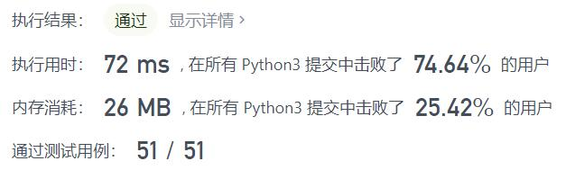
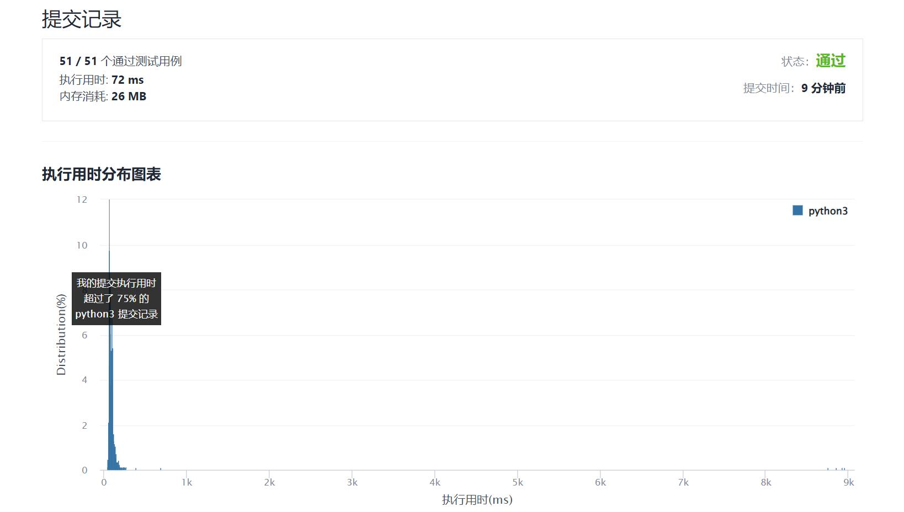

# 219-存在重复元素II

Author：_Mumu

创建日期：2022/01/19

通过日期：2022/01/19

*****

踩过的坑：

1. 轻松愉快
2. 想到了存储最后一次出现的下标，但没想到滑动窗口

已解决：212/2497

*****

难度：简单

问题描述：

给你一个整数数组 nums 和一个整数 k ，判断数组中是否存在两个 不同的索引 i 和 j ，满足 nums[i] == nums[j] 且 abs(i - j) <= k 。如果存在，返回 true ；否则，返回 false 。

 

示例 1：

输入：nums = [1,2,3,1], k = 3
输出：true
示例 2：

输入：nums = [1,0,1,1], k = 1
输出：true
示例 3：

输入：nums = [1,2,3,1,2,3], k = 2
输出：false

提示：

1 <= nums.length <= 105
-109 <= nums[i] <= 109
0 <= k <= 105

来源：力扣（LeetCode）
链接：https://leetcode-cn.com/problems/contains-duplicate-ii
