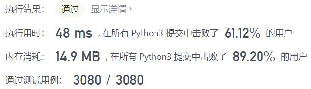
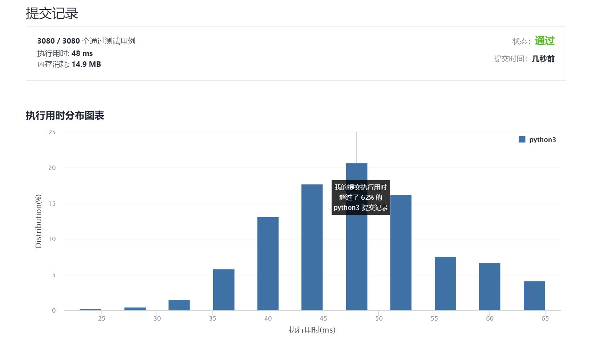

# 223-矩形面积

Author：_Mumu

创建日期：2021/9/30

通过日期：2021/9/30

*****

踩过的坑：

1. 还是简单的，只要搞清楚了两矩形如何互相覆盖就很容易（不过通过率才51.4%，看来搞清楚这件事也不简单）
2. 记覆盖部分矩形左下角坐标$(cx1, cy1)$​​和右上角坐标$(cx2, cy2)$​​，那么$cx1$​​必然在$\{ax1, bx1\}$​​中取，且必为大者，$cx2$​​必然在$\{ax2, bx2\}$​​​​中取，且必为小者，故不需要分类讨论，只需要使用`max()`和`min()`即可
3. 第一次看题没认真看没看到是左下顶点和右上顶点，还在想不是这种情况的话该怎么办，蠢了

已解决：102/2376

*****

难度：中等

问题描述：

给你 二维 平面上两个 由直线构成的 矩形，请你计算并返回两个矩形覆盖的总面积。

每个矩形由其 左下 顶点和 右上 顶点坐标表示：

第一个矩形由其左下顶点 (ax1, ay1) 和右上顶点 (ax2, ay2) 定义。
第二个矩形由其左下顶点 (bx1, by1) 和右上顶点 (bx2, by2) 定义。

示例 1：

输入：ax1 = -3, ay1 = 0, ax2 = 3, ay2 = 4, bx1 = 0, by1 = -1, bx2 = 9, by2 = 2
输出：45
示例 2：

输入：ax1 = -2, ay1 = -2, ax2 = 2, ay2 = 2, bx1 = -2, by1 = -2, bx2 = 2, by2 = 2
输出：16

提示：

-104 <= ax1, ay1, ax2, ay2, bx1, by1, bx2, by2 <= 104

来源：力扣（LeetCode）
链接：https://leetcode-cn.com/problems/rectangle-area
