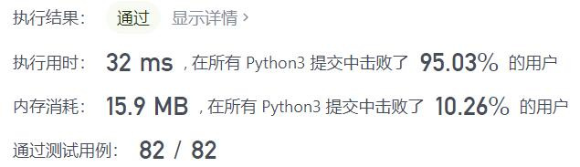
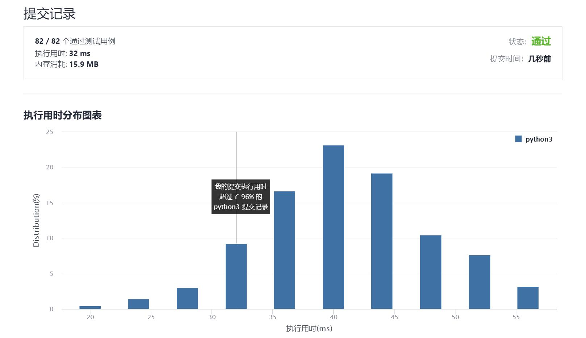

# 229-求众数II

Author：_Mumu

创建日期：2021/10/22

通过日期：2021/10/22

*****

踩过的坑：

1. 耶！摩尔投票！终于把学过的算法用起来了，开心！
2. 不过忘记最后检查一下是否两个数字实际上都是众数惹
3. 因为投票出来的可能是偷鸡取胜的呀

已解决：125/2401

*****

难度：中等

问题描述：

给定一个大小为 n 的整数数组，找出其中所有出现超过 ⌊ n/3 ⌋ 次的元素。

 

 

示例 1：

输入：[3,2,3]
输出：[3]
示例 2：

输入：nums = [1]
输出：[1]
示例 3：

输入：[1,1,1,3,3,2,2,2]
输出：[1,2]

提示：

1 <= nums.length <= 5 * 104
-109 <= nums[i] <= 109

进阶：尝试设计时间复杂度为 O(n)、空间复杂度为 O(1)的算法解决此问题。

来源：力扣（LeetCode）
链接：https://leetcode-cn.com/problems/majority-element-ii
