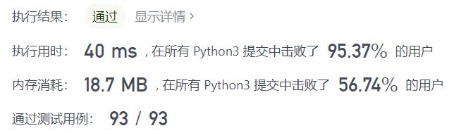
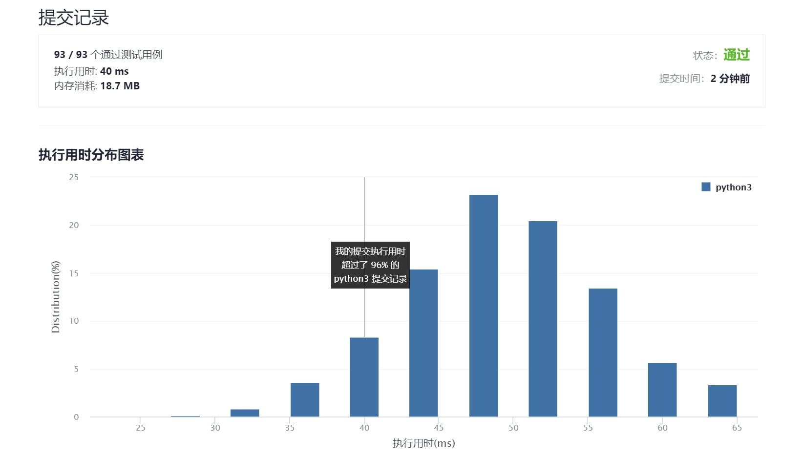

# 230-二叉搜索树中第K小的元素

Author：_Mumu

创建日期：2021/10/17

通过日期：2021/10/17

*****

踩过的坑：

1. 轻松愉快的深度优先搜索
2. 不过没有想到可以通过栈实现搜索并且实现随时中断搜索过程
3. 虽然我的算法还是更快一点的
4. 题解方法3实属牛逼，转换为平衡二叉搜索树解决题目问题与进阶问题

已解决：120/2400

*****

难度：中等

问题描述：

给定一个二叉搜索树的根节点 root ，和一个整数 k ，请你设计一个算法查找其中第 k 个最小元素（从 1 开始计数）。

 

示例 1：

输入：root = [3,1,4,null,2], k = 1
输出：1
示例 2：

输入：root = [5,3,6,2,4,null,null,1], k = 3
输出：3

提示：

树中的节点数为 n 。
1 <= k <= n <= 104
0 <= Node.val <= 104

进阶：如果二叉搜索树经常被修改（插入/删除操作）并且你需要频繁地查找第 k 小的值，你将如何优化算法？

来源：力扣（LeetCode）
链接：https://leetcode-cn.com/problems/kth-smallest-element-in-a-bst
