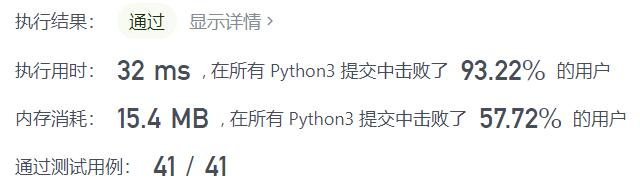
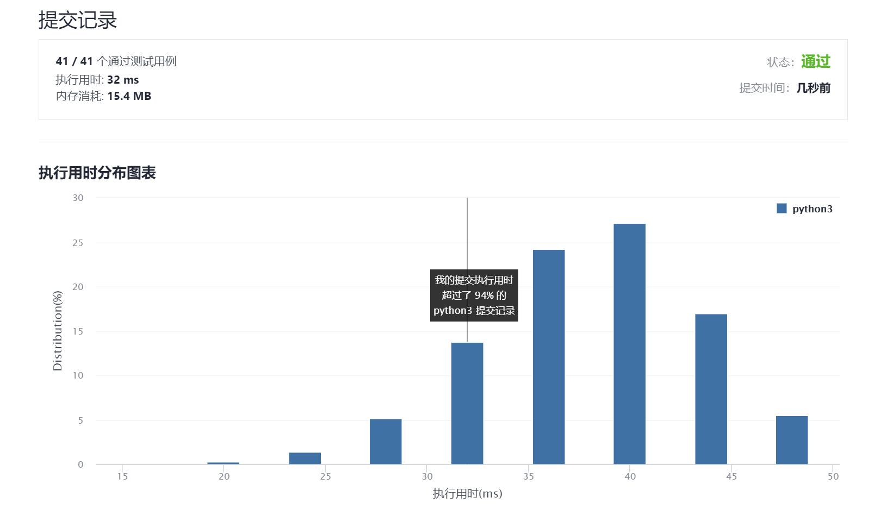

# 237-删除链表中的节点

Author：_Mumu

创建日期：2021/11/02

通过日期：2021/11/02

*****

踩过的坑：

1. 过于简单了属于是x2
2. 平常删除链表元素的办法是令待删除结点的上一个节点直接指向待删除结点的下一个节点，但是本题无法访问上一个节点，于是考虑直接将待删除节点改装为其下一个节点，然后将下一个节点删除，也能达到相同效果
3. 不过问题是该方法无法删除末尾节点，毕竟删除末尾节点只能通过令倒数第二个节点指向空指针才能实现
4. 题解不释放内存，差评

已解决：139/2415

*****

难度：简单

问题描述：

请编写一个函数，用于 删除单链表中某个特定节点 。在设计函数时需要注意，你无法访问链表的头节点 head ，只能直接访问 要被删除的节点 。

题目数据保证需要删除的节点 不是末尾节点 。

 

示例 1：

输入：head = [4,5,1,9], node = 5
输出：[4,1,9]
解释：指定链表中值为 5 的第二个节点，那么在调用了你的函数之后，该链表应变为 4 -> 1 -> 9
示例 2：

输入：head = [4,5,1,9], node = 1
输出：[4,5,9]
解释：指定链表中值为 1 的第三个节点，那么在调用了你的函数之后，该链表应变为 4 -> 5 -> 9
示例 3：

输入：head = [1,2,3,4], node = 3
输出：[1,2,4]
示例 4：

输入：head = [0,1], node = 0
输出：[1]
示例 5：

输入：head = [-3,5,-99], node = -3
输出：[5,-99]

提示：

链表中节点的数目范围是 [2, 1000]
-1000 <= Node.val <= 1000
链表中每个节点的值都是唯一的
需要删除的节点 node 是 链表中的一个有效节点 ，且 不是末尾节点

来源：力扣（LeetCode）
链接：https://leetcode-cn.com/problems/delete-node-in-a-linked-list
