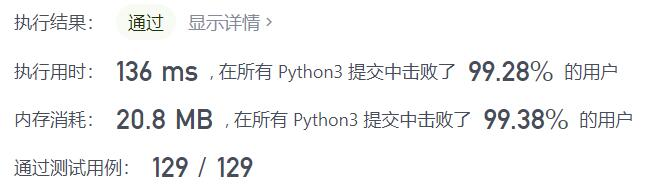
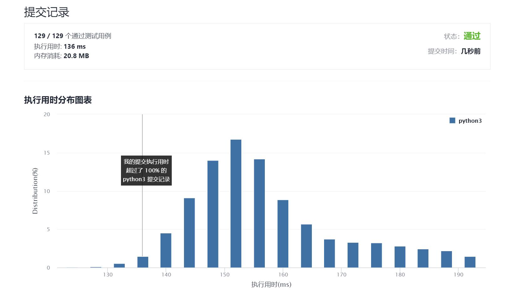

# 240-搜索二维矩阵II

Author：_Mumu

创建日期：2021/10/25

通过日期：2021/10/25

*****

踩过的坑：

1. Z字形查找牛蛙
2. 定义一个搜索节点$(i,j)$​初始化为矩阵右上角$(i_0,j_0)=(0,n-1)$​​，搜索范围为矩阵左下角$(m-1,0)$​至$(i,j)$​之间的子矩阵，每一次搜索有以下三种情况
3. 若$matrix_{ij}=target$则返回`True`
4. 若$matrix_{ij}<target$​​​说明目标即使存在也不会在矩阵的$i$​行，则`i += 1`
5. 若$matrix_{ij}>target$​说明目标即使存在也不会在矩阵的$j$​​列，则`j -= 1`
6. 搜索完$(i,j)=(m-1,0)$的情况后若还未找到目标，则目标不存在与矩阵中，返回`False`

已解决：128/2405

*****

难度：中等

问题描述：

编写一个高效的算法来搜索 m x n 矩阵 matrix 中的一个目标值 target 。该矩阵具有以下特性：

每行的元素从左到右升序排列。
每列的元素从上到下升序排列。

示例 1：

输入：matrix = [[1,4,7,11,15],[2,5,8,12,19],[3,6,9,16,22],[10,13,14,17,24],[18,21,23,26,30]], target = 5
输出：true
示例 2：

输入：matrix = [[1,4,7,11,15],[2,5,8,12,19],[3,6,9,16,22],[10,13,14,17,24],[18,21,23,26,30]], target = 20
输出：false

提示：

m == matrix.length
n == matrix[i].length
1 <= n, m <= 300
-109 <= matrix[i][j] <= 109
每行的所有元素从左到右升序排列
每列的所有元素从上到下升序排列
-109 <= target <= 109

来源：力扣（LeetCode）
链接：https://leetcode-cn.com/problems/search-a-2d-matrix-ii
