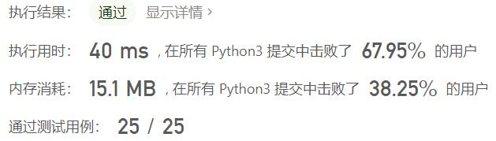
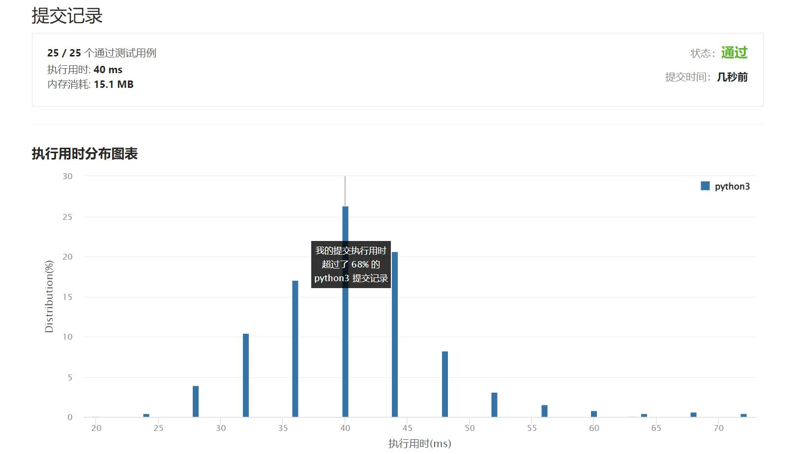

# 241-为运算表达式设计优先级

Author：_Mumu

创建日期：2022/07/01

通过日期：2022/07/01

*****

踩过的坑：

1. 轻松愉快
1. 先处理为数字、符号相间的列表，然后枚举每个符号（符号所在下标必然是奇数）作为最后计算的运算符，dfs计算该运算符左侧和右侧所有可能的运算结果，再遍历两侧结果结合运算符生成最终运算结果
1. 因为可能重复计算某些区间的结果，使用`@lru_cache(None)`提速

已解决：387/2689

*****

难度：中等

问题描述：

给你一个由数字和运算符组成的字符串 expression ，按不同优先级组合数字和运算符，计算并返回所有可能组合的结果。你可以 按任意顺序 返回答案。

生成的测试用例满足其对应输出值符合 32 位整数范围，不同结果的数量不超过 104 。

 

示例 1：

输入：expression = "2-1-1"
输出：[0,2]
解释：
((2-1)-1) = 0 
(2-(1-1)) = 2
示例 2：

输入：expression = "2*3-4*5"
输出：[-34,-14,-10,-10,10]
解释：
(2*(3-(4*5))) = -34 
((2*3)-(4*5)) = -14 
((2*(3-4))*5) = -10 
(2*((3-4)*5)) = -10 
(((2*3)-4)*5) = 10

提示：

1 <= expression.length <= 20
expression 由数字和算符 '+'、'-' 和 '*' 组成。
输入表达式中的所有整数值在范围 [0, 99] 

来源：力扣（LeetCode）
链接：https://leetcode.cn/problems/different-ways-to-add-parentheses