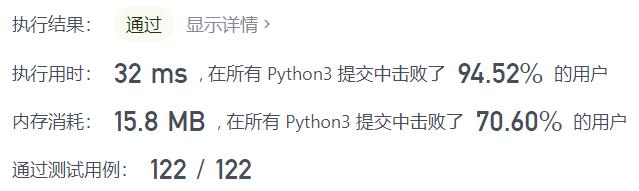
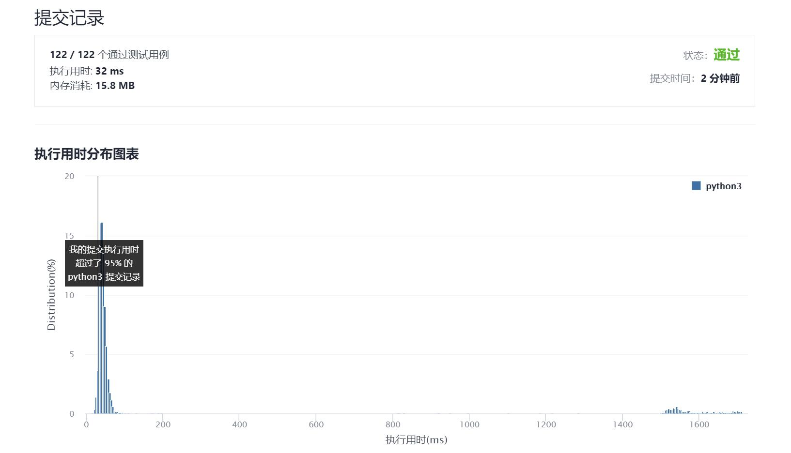

# 268-丢失的数字

Author：_Mumu

创建日期：2021/11/06

通过日期：2021/11/06

*****

踩过的坑：

1. 舒服
2. 异或真的无敌舒适
3. 然而却没有想到可以直接求和减去数组和，思想和异或都是一样的，利用已知信息把降低空间复杂度，只利用单一变量找出数组丢失的信息
4. 求和的优势在于利用等差数列求和公式可以把运行步数降至异或算法的一半，异或的优势在于如果数组较长，数据也不容易溢出，运算每一步的时间也更短一些

已解决：143/2416

*****

难度：简单

问题描述：

给定一个包含 [0, n] 中 n 个数的数组 nums ，找出 [0, n] 这个范围内没有出现在数组中的那个数。

 

示例 1：

输入：nums = [3,0,1]
输出：2
解释：n = 3，因为有 3 个数字，所以所有的数字都在范围 [0,3] 内。2 是丢失的数字，因为它没有出现在 nums 中。
示例 2：

输入：nums = [0,1]
输出：2
解释：n = 2，因为有 2 个数字，所以所有的数字都在范围 [0,2] 内。2 是丢失的数字，因为它没有出现在 nums 中。
示例 3：

输入：nums = [9,6,4,2,3,5,7,0,1]
输出：8
解释：n = 9，因为有 9 个数字，所以所有的数字都在范围 [0,9] 内。8 是丢失的数字，因为它没有出现在 nums 中。
示例 4：

输入：nums = [0]
输出：1
解释：n = 1，因为有 1 个数字，所以所有的数字都在范围 [0,1] 内。1 是丢失的数字，因为它没有出现在 nums 中。

提示：

n == nums.length
1 <= n <= 104
0 <= nums[i] <= n
nums 中的所有数字都 独一无二

进阶：你能否实现线性时间复杂度、仅使用额外常数空间的算法解决此问题?

来源：力扣（LeetCode）
链接：https://leetcode-cn.com/problems/missing-number
