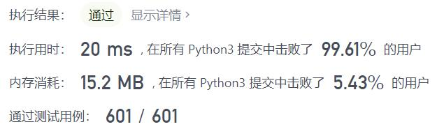
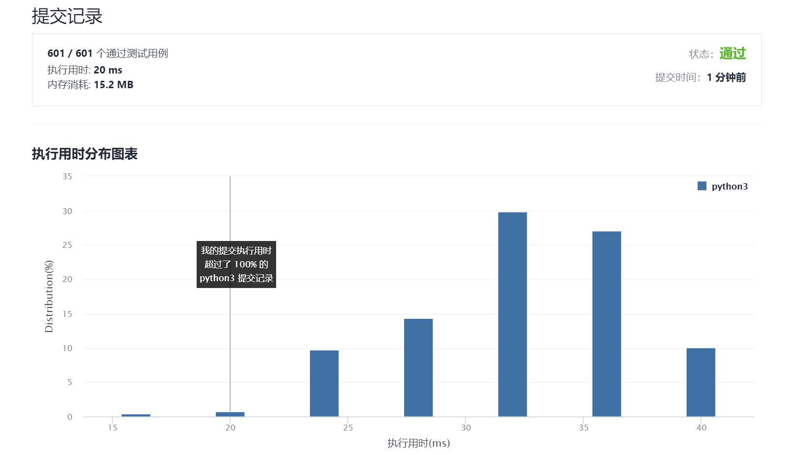

# 273-整数转换英文表示

Author：_Mumu

创建日期：2021/10/11

通过日期：2021/10/11

*****

踩过的坑：

1. 困难：指单词拼写
2. 好像写递归确实好看点

已解决：113/2390

*****

难度：困难

问题描述：

将非负整数 num 转换为其对应的英文表示。

 

示例 1：

输入：num = 123
输出："One Hundred Twenty Three"
示例 2：

输入：num = 12345
输出："Twelve Thousand Three Hundred Forty Five"
示例 3：

输入：num = 1234567
输出："One Million Two Hundred Thirty Four Thousand Five Hundred Sixty Seven"
示例 4：

输入：num = 1234567891
输出："One Billion Two Hundred Thirty Four Million Five Hundred Sixty Seven Thousand Eight Hundred Ninety One"

提示：

0 <= num <= 231 - 1

来源：力扣（LeetCode）
链接：https://leetcode-cn.com/problems/integer-to-english-words
