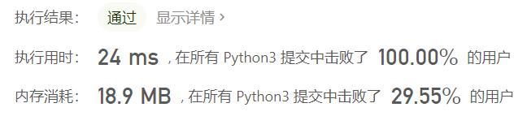
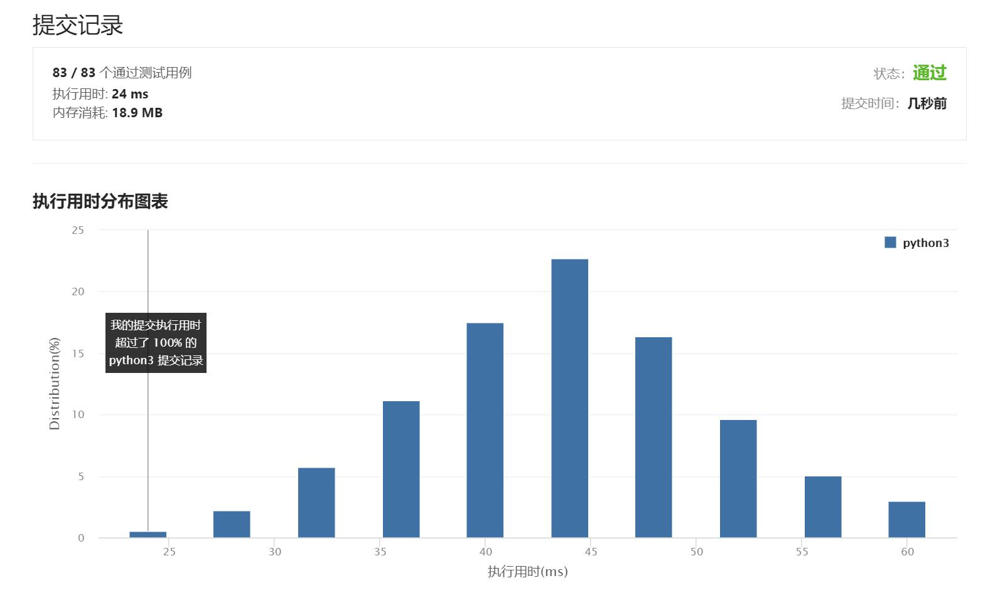

# 275-H 指数II

Author：_Mumu

创建日期：2021/7/12

通过日期：2021/7/12

*****

踩过的坑：

1. 我起了，一刀秒了，没什么好说的
2. 二分法永远滴神
3. 基本思路：将数组下标$i$看作整型自变量，数组某一位置到数组右端的距离为下标的一个减函数$d(i)$，而引用次数为一个增函数$c(i)$
4. 两函数图像的位置关系只有两种情况：①两者的折线有且仅有一个交点（不一定在整数坐标上）；②$c(i)>d(i), \forall i$
5. 算法需要做的就是找出使$c(i)\ge d(i)$的最小的整数$i$，即找到了使不等式成立的最大的$d(i)$

已解决：39/2161

*****

难度：中等

问题描述：

给定一位研究者论文被引用次数的数组（被引用次数是非负整数），数组已经按照 升序排列 。编写一个方法，计算出研究者的 h 指数。

h 指数的定义: “h 代表“高引用次数”（high citations），一名科研人员的 h 指数是指他（她）的 （N 篇论文中）总共有 h 篇论文分别被引用了至少 h 次。（其余的 N - h 篇论文每篇被引用次数不多于 h 次。）"

 

示例:

输入: citations = [0,1,3,5,6]
输出: 3 
解释: 给定数组表示研究者总共有 5 篇论文，每篇论文相应的被引用了 0, 1, 3, 5, 6 次。
     由于研究者有 3 篇论文每篇至少被引用了 3 次，其余两篇论文每篇被引用不多于 3 次，所以她的 h 指数是 3。

说明:

如果 h 有多有种可能的值 ，h 指数是其中最大的那个。

 

进阶：

这是 H 指数 的延伸题目，本题中的 citations 数组是保证有序的。
你可以优化你的算法到对数时间复杂度吗？

来源：力扣（LeetCode）
链接：https://leetcode-cn.com/problems/h-index-ii