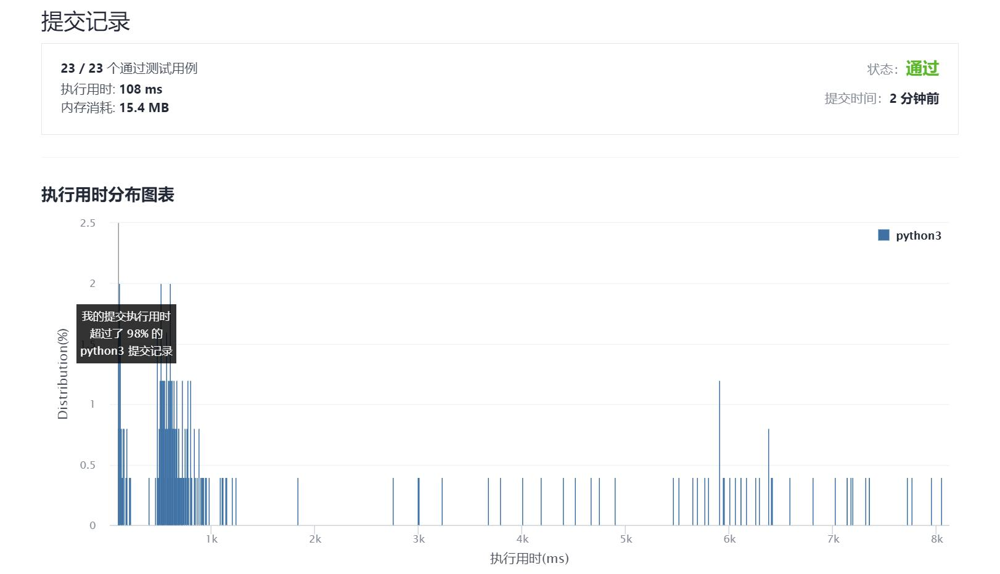

# 282-给表达式添加运算符

Author：_Mumu

创建日期：2021/10/16

通过日期：2021/10/16

*****

踩过的坑：

1. 好难，看题解写的
2. 想到了暴力枚举，但是没想到可以用深度优先搜索+回溯来简化，虽然不管咋样时间复杂度还是$O(4^n)$
3. 另外大佬的剪枝也很妙
4. 希望下次看到这种题能够自己写出来

已解决：119/2395

*****

难度：困难

问题描述：

给定一个仅包含数字 0-9 的字符串 num 和一个目标值整数 target ，在 num 的数字之间添加 二元 运算符（不是一元）+、- 或 * ，返回所有能够得到目标值的表达式。

 

示例 1:

输入: num = "123", target = 6
输出: ["1+2+3", "1*2*3"] 
示例 2:

输入: num = "232", target = 8
输出: ["2*3+2", "2+3*2"]
示例 3:

输入: num = "105", target = 5
输出: ["1*0+5","10-5"]
示例 4:

输入: num = "00", target = 0
输出: ["0+0", "0-0", "0*0"]
示例 5:

输入: num = "3456237490", target = 9191
输出: []

提示：

1 <= num.length <= 10
num 仅含数字
-231 <= target <= 231 - 1

来源：力扣（LeetCode）
链接：https://leetcode-cn.com/problems/expression-add-operators
