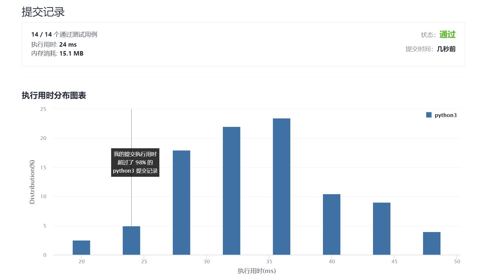

# 284-顶端迭代器

Author：_Mumu

创建日期：2021/10/5

通过日期：2021/10/5

*****

踩过的坑：

1. 意思就是用一个没有`self.peek()`方法的迭代器实现一个有该方法的迭代器
2. 主要就是`.peek()`和`.next()`中该如何令原迭代器迭代的问题
3. 方法是创建一个变量`self.pk`存储当前的`.peek()`值，初始化为`None`
4. 当`self.pk`为`None`时，`.peek()`会令原迭代器迭代，并将值赋给`self.pk`；而`.next()`则只令原迭代器迭代
5. 当`self.pk`不为`None`时，说明当前迭代器使用过`.peek()`使原迭代器指针已指向下一位，而自身指针并未移动，所以此时`.peek()`应直接返回`self.pk`；而`.next()`应返回`self.pk`，同时令`self.pk = None`，使指针与原迭代器保持一致
6. 最后，当指针在迭代器最后一位时，`.peek()`会使原迭代器指针移动，使原迭代器`.hasNext()`返回`False`，但当前迭代器指针并未移动`.hasNext()`仍应返回`True`，只需加上当`self.pk`不为空时返回`True`的条件即可
7. 不过这个算法会在原迭代器中有`None`时失效
8. 题解做法的逻辑更简单易懂

已解决：107/2385

*****

难度：中等

问题描述：

请你设计一个迭代器，除了支持 hasNext 和 next 操作外，还支持 peek 操作。

实现 PeekingIterator 类：

PeekingIterator(int[] nums) 使用指定整数数组 nums 初始化迭代器。
int next() 返回数组中的下一个元素，并将指针移动到下个元素处。
bool hasNext() 如果数组中存在下一个元素，返回 true ；否则，返回 false 。
int peek() 返回数组中的下一个元素，但 不 移动指针。

示例：

输入：
["PeekingIterator", "next", "peek", "next", "next", "hasNext"]
[[[1, 2, 3]], [], [], [], [], []]
输出：
[null, 1, 2, 2, 3, false]

解释：
PeekingIterator peekingIterator = new PeekingIterator([1, 2, 3]); // [1,2,3]
peekingIterator.next();    // 返回 1 ，指针移动到下一个元素 [1,2,3]
peekingIterator.peek();    // 返回 2 ，指针未发生移动 [1,2,3]
peekingIterator.next();    // 返回 2 ，指针移动到下一个元素 [1,2,3]
peekingIterator.next();    // 返回 3 ，指针移动到下一个元素 [1,2,3]
peekingIterator.hasNext(); // 返回 False

提示：

1 <= nums.length <= 1000
1 <= nums[i] <= 1000
对 next 和 peek 的调用均有效
next、hasNext 和 peek 最多调用  1000 次

进阶：你将如何拓展你的设计？使之变得通用化，从而适应所有的类型，而不只是整数型？

来源：力扣（LeetCode）
链接：https://leetcode-cn.com/problems/peeking-iterator
