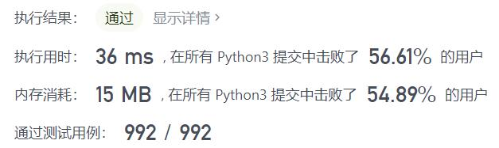
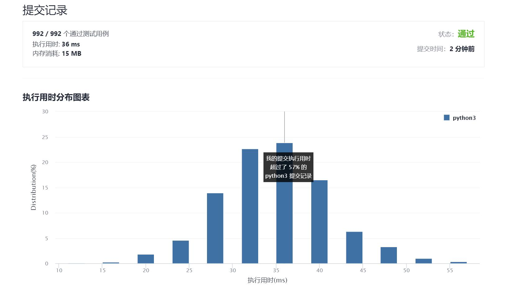

# 29-两数相除

Author：_Mumu

创建日期：2021/10/12

通过日期：2021/10/12

*****

踩过的坑：

1. 一开始蠢蠢地暴力了
2. 看了题解，用加法实现快速乘法，虽然忘记了快速幂是怎么写的，但是自己整了一个，不断叠加除数自身得到除数的2的幂次倍，从而可以快速计算商

已解决：114/2390

*****

难度：中等

问题描述：

给定两个整数，被除数 dividend 和除数 divisor。将两数相除，要求不使用乘法、除法和 mod 运算符。

返回被除数 dividend 除以除数 divisor 得到的商。

整数除法的结果应当截去（truncate）其小数部分，例如：truncate(8.345) = 8 以及 truncate(-2.7335) = -2

 

示例 1:

输入: dividend = 10, divisor = 3
输出: 3
解释: 10/3 = truncate(3.33333..) = truncate(3) = 3
示例 2:

输入: dividend = 7, divisor = -3
输出: -2
解释: 7/-3 = truncate(-2.33333..) = -2

提示：

被除数和除数均为 32 位有符号整数。
除数不为 0。
假设我们的环境只能存储 32 位有符号整数，其数值范围是 [−231,  231 − 1]。本题中，如果除法结果溢出，则返回 231 − 1。

来源：力扣（LeetCode）
链接：https://leetcode-cn.com/problems/divide-two-integers
