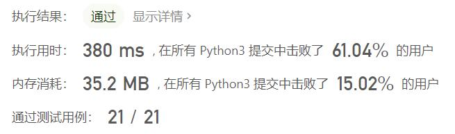
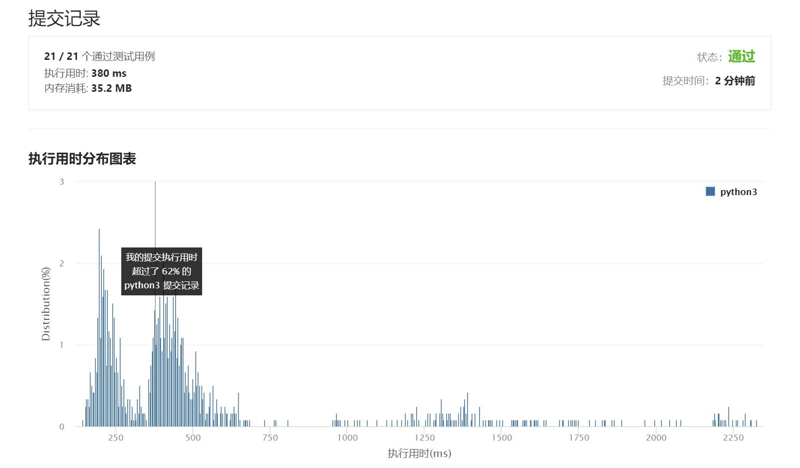

# 295-数据流的中位数

Author：_Mumu

创建日期：2021/8/27

通过日期：2021/8/27

*****

踩过的坑：

1. 好牛
2. 学习使用堆的一天，真好用
3. 题目要求是中位数，因此所有输入数据都必须存储，并且需要选择合适的数据格式让中位数能方便得到
4. 主要思路有两个：①用数组存储，则必须为有序数组，此时再使用两个指针指向中位数可以加快提取中位数的速度；②使用两个堆，一个小根堆存储较大一半的数据，一个大根堆存储较小一半的数据
5. 对思路①：难度主要在于每次加入数据时指针的维护，由于指针总是指向数组正中间，因此每次加数据时不论数据加在何位置，指针移动的方式都是一模一样的：对奇数长度数组加入数据，右指针右移一位；对偶数长度数组加入数据，左指针右移一位与右指针重合
6. 对思路②：由于python堆默认为小根堆，因此较小一半的数据取负数后再存储即可，实际操作上可令小根堆大小与大根堆相同或比大根堆多1，这样在结果输出时只需要判断两个堆大小是否相同，相同则输出两堆的根的平均值，不同则输出小根堆的根；而在加入数据时，两个堆大小不同时，在小根堆中加入数据再弹出，然后把弹出的值加入大根堆，相同时则在大根堆中加入数据的相反数再弹出，然后把弹出的值加入小根堆，这样就能保证堆的大小符合之前的约定
7. 关于进阶问题1：构造长度为101的数组，直接对输入的每种数字计数，取中位数时统计个数即可
8. 关于进阶问题2：构造长度为101的数组，对$[0,100]$​的整数计数，再构造两个有序数组分别存储小于0的数据和大于100的数据，取中位数时统计个数即可，偶尔中位数可能出现在外围时，暴力提取即可

已解决：69/2326

*****

难度：困难

问题描述：

中位数是有序列表中间的数。如果列表长度是偶数，中位数则是中间两个数的平均值。

例如，

[2,3,4] 的中位数是 3

[2,3] 的中位数是 (2 + 3) / 2 = 2.5

设计一个支持以下两种操作的数据结构：

void addNum(int num) - 从数据流中添加一个整数到数据结构中。
double findMedian() - 返回目前所有元素的中位数。
示例：

addNum(1)
addNum(2)
findMedian() -> 1.5
addNum(3) 
findMedian() -> 2
进阶:

如果数据流中所有整数都在 0 到 100 范围内，你将如何优化你的算法？
如果数据流中 99% 的整数都在 0 到 100 范围内，你将如何优化你的算法？

来源：力扣（LeetCode）
链接：https://leetcode-cn.com/problems/find-median-from-data-stream
