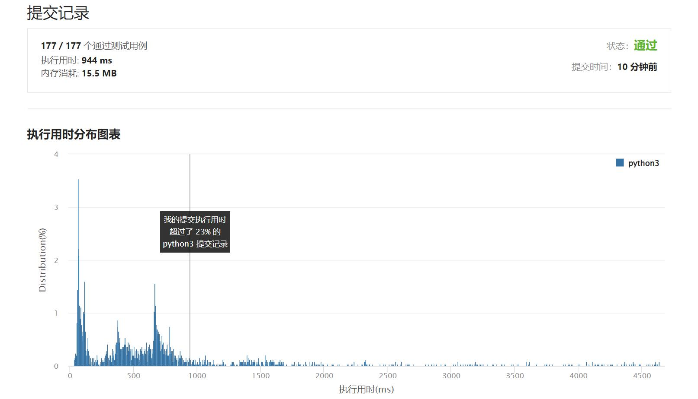

# 30-串联所有单词的子串

Author：_Mumu

创建日期：2022/06/23

通过日期：2022/06/23

*****

踩过的坑：

1. 轻松愉快
1. 一道可以用中等方法做出来的困难题

已解决：378/2679

*****

难度：困难

问题描述：

给定一个字符串 s 和一些 长度相同 的单词 words 。找出 s 中恰好可以由 words 中所有单词串联形成的子串的起始位置。

注意子串要与 words 中的单词完全匹配，中间不能有其他字符 ，但不需要考虑 words 中单词串联的顺序。

 

示例 1：

输入：s = "barfoothefoobarman", words = ["foo","bar"]
输出：[0,9]
解释：
从索引 0 和 9 开始的子串分别是 "barfoo" 和 "foobar" 。
输出的顺序不重要, [9,0] 也是有效答案。
示例 2：

输入：s = "wordgoodgoodgoodbestword", words = ["word","good","best","word"]
输出：[]
示例 3：

输入：s = "barfoofoobarthefoobarman", words = ["bar","foo","the"]
输出：[6,9,12]

提示：

1 <= s.length <= 104
s 由小写英文字母组成
1 <= words.length <= 5000
1 <= words[i].length <= 30
words[i] 由小写英文字母组成

来源：力扣（LeetCode）
链接：https://leetcode.cn/problems/substring-with-concatenation-of-all-words