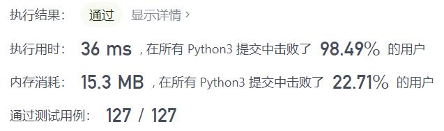
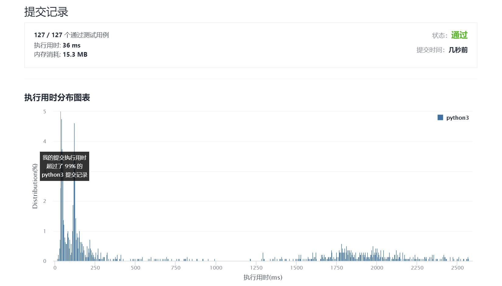

# 301-删除无效的括号

Author：_Mumu

创建日期：2021/10/27

通过日期：2021/10/27

*****

踩过的坑：

1. 好难，不愧是困难
2. 老是搞不好这种要么广度优先、要么深度优先+回溯剪枝的题
3. 希望下次可以自己搞出来

已解决：130/2406

*****

难度：困难

问题描述：

给你一个由若干括号和字母组成的字符串 s ，删除最小数量的无效括号，使得输入的字符串有效。

返回所有可能的结果。答案可以按 任意顺序 返回。

 

示例 1：

输入：s = "()())()"
输出：["(())()","()()()"]
示例 2：

输入：s = "(a)())()"
输出：["(a())()","(a)()()"]
示例 3：

输入：s = ")("
输出：[""]

提示：

1 <= s.length <= 25
s 由小写英文字母以及括号 '(' 和 ')' 组成
s 中至多含 20 个括号

来源：力扣（LeetCode）
链接：https://leetcode-cn.com/problems/remove-invalid-parentheses
