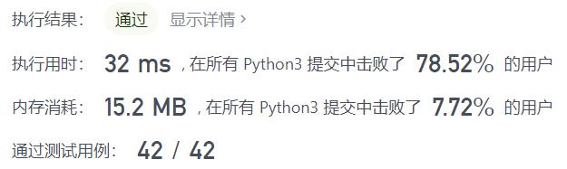
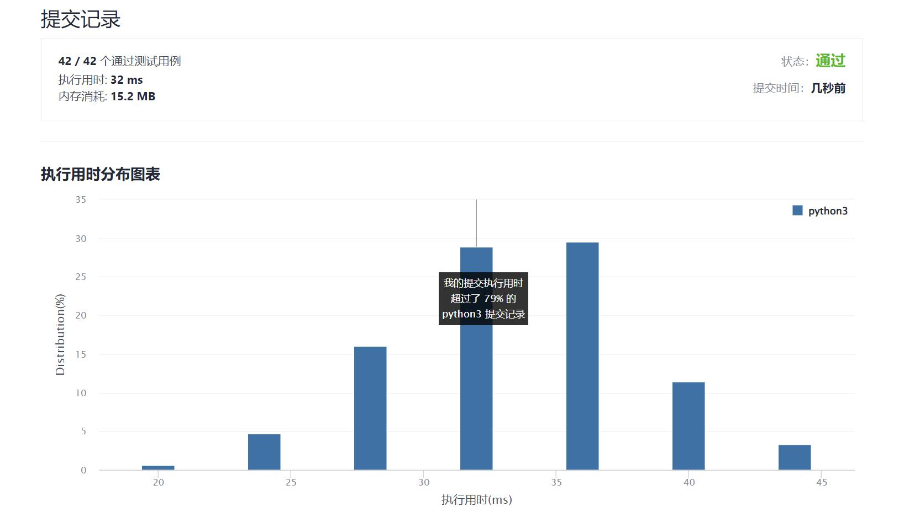

# 306-累加数

Author：_Mumu

创建日期：2022/01/10

通过日期：2022/01/10

*****

踩过的坑：

1. 写吐了，这尼玛是中等？
2. 核心就是第一个和第二个数确定了整个序列，所以只需要暴力搜索所有可能的前两个数的组合判断能否构成序列即可
3. 哎，题解是真的写得很清晰，居然不用递归回溯就能写出来
4. 而且直接用字符串加法防止溢出并方便得到数字长度，牛

已解决：203/2491

*****

难度：中等

问题描述：

累加数 是一个字符串，组成它的数字可以形成累加序列。

一个有效的 累加序列 必须 至少 包含 3 个数。除了最开始的两个数以外，字符串中的其他数都等于它之前两个数相加的和。

给你一个只包含数字 '0'-'9' 的字符串，编写一个算法来判断给定输入是否是 累加数 。如果是，返回 true ；否则，返回 false 。

说明：累加序列里的数 不会 以 0 开头，所以不会出现 1, 2, 03 或者 1, 02, 3 的情况。

 

示例 1：

输入："112358"
输出：true 
解释：累加序列为: 1, 1, 2, 3, 5, 8 。1 + 1 = 2, 1 + 2 = 3, 2 + 3 = 5, 3 + 5 = 8
示例 2：

输入："199100199"
输出：true 
解释：累加序列为: 1, 99, 100, 199。1 + 99 = 100, 99 + 100 = 199

提示：

1 <= num.length <= 35
num 仅由数字（0 - 9）组成

进阶：你计划如何处理由过大的整数输入导致的溢出?

来源：力扣（LeetCode）
链接：https://leetcode-cn.com/problems/additive-number
