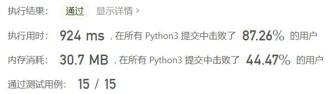
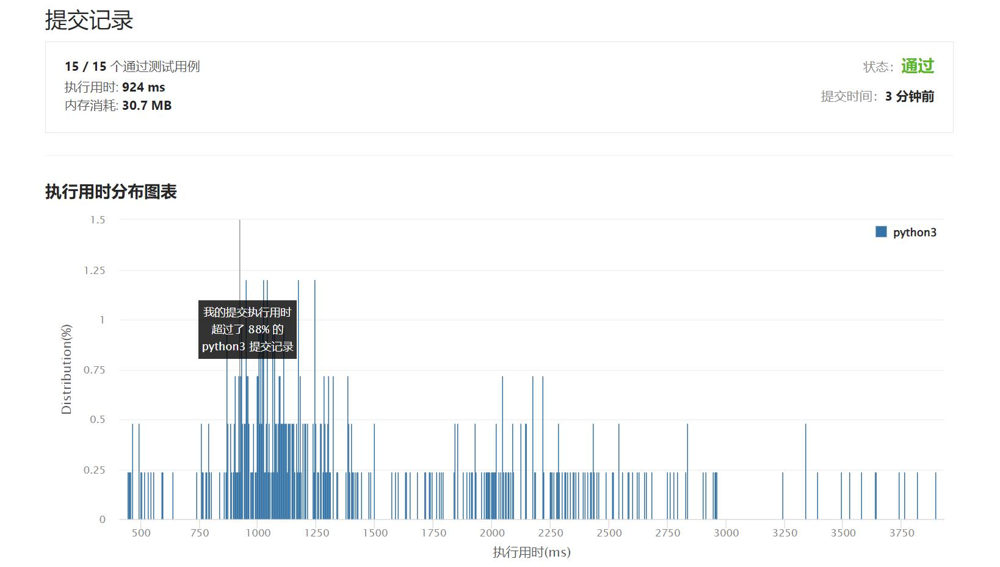

# 307-区域和检索 - 数组可修改

Author：_Mumu

创建日期：2022/04/04

通过日期：2022/04/04

*****

踩过的坑：

1. 树状数组是什么玩儿

已解决：299/2582

*****

难度：中等

问题描述：

给你一个数组 nums ，请你完成两类查询。

其中一类查询要求 更新 数组 nums 下标对应的值
另一类查询要求返回数组 nums 中索引 left 和索引 right 之间（ 包含 ）的nums元素的 和 ，其中 left <= right
实现 NumArray 类：

NumArray(int[] nums) 用整数数组 nums 初始化对象
void update(int index, int val) 将 nums[index] 的值 更新 为 val
int sumRange(int left, int right) 返回数组 nums 中索引 left 和索引 right 之间（ 包含 ）的nums元素的 和 （即，nums[left] + nums[left + 1], ..., nums[right]）

示例 1：

输入：
["NumArray", "sumRange", "update", "sumRange"]
[[[1, 3, 5]], [0, 2], [1, 2], [0, 2]]
输出：
[null, 9, null, 8]

解释：
NumArray numArray = new NumArray([1, 3, 5]);
numArray.sumRange(0, 2); // 返回 1 + 3 + 5 = 9
numArray.update(1, 2);   // nums = [1,2,5]
numArray.sumRange(0, 2); // 返回 1 + 2 + 5 = 8

提示：

1 <= nums.length <= 3 * 104
-100 <= nums[i] <= 100
0 <= index < nums.length
-100 <= val <= 100
0 <= left <= right < nums.length
调用 update 和 sumRange 方法次数不大于 3 * 104 

来源：力扣（LeetCode）
链接：https://leetcode-cn.com/problems/range-sum-query-mutable