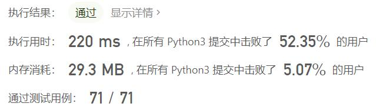
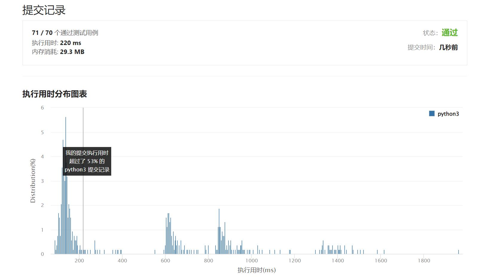

# 310-最小高度树

Author：_Mumu

创建日期：2022/04/06

通过日期：2022/04/06

*****

踩过的坑：

1. 这中等题竟也写了我半条命去
1. 最小高度树一定是把图中最长路径折半的树，因此只需要找到最长路径，该路径的中间一个或两个节点就是答案，如果有多条最长路径，那么它们中间那段必然是重合的，否则将导致存在更长的路径或者存在环，所以只需要找到其中一条最长路径即可
1. 而找到最长路径也很容易，随意从一个节点出发，找到距离该节点最远的节点，这个节点就是某条最长路径的一个端点，再从这个节点出发寻找一次就找到了最长路径
1. 遍历过程中存储各节点的父节点，倒推可找到最长路径的中间节点

已解决：301/2583

*****

难度：中等

问题描述：

树是一个无向图，其中任何两个顶点只通过一条路径连接。 换句话说，一个任何没有简单环路的连通图都是一棵树。

给你一棵包含 n 个节点的树，标记为 0 到 n - 1 。给定数字 n 和一个有 n - 1 条无向边的 edges 列表（每一个边都是一对标签），其中 edges[i] = [ai, bi] 表示树中节点 ai 和 bi 之间存在一条无向边。

可选择树中任何一个节点作为根。当选择节点 x 作为根节点时，设结果树的高度为 h 。在所有可能的树中，具有最小高度的树（即，min(h)）被称为 最小高度树 。

请你找到所有的 最小高度树 并按 任意顺序 返回它们的根节点标签列表。

树的 高度 是指根节点和叶子节点之间最长向下路径上边的数量。

示例 1：

输入：n = 4, edges = [[1,0],[1,2],[1,3]]
输出：[1]
解释：如图所示，当根是标签为 1 的节点时，树的高度是 1 ，这是唯一的最小高度树。
示例 2：

输入：n = 6, edges = [[3,0],[3,1],[3,2],[3,4],[5,4]]
输出：[3,4]

提示：

1 <= n <= 2 * 104
edges.length == n - 1
0 <= ai, bi < n
ai != bi
所有 (ai, bi) 互不相同
给定的输入 保证 是一棵树，并且 不会有重复的边

来源：力扣（LeetCode）
链接：https://leetcode-cn.com/problems/minimum-height-trees