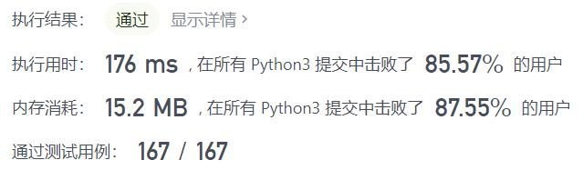
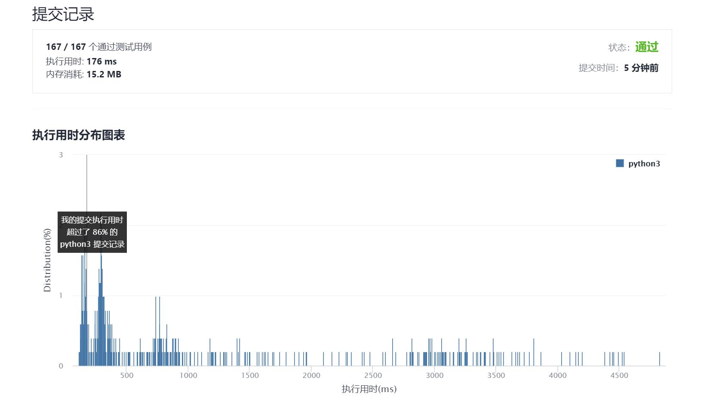

# 318-最大单词长度乘积

Author：_Mumu

创建日期：2021/11/17

通过日期：2021/11/17

*****

踩过的坑：

1. 简单是简单，还是学了很多高级写法的
2. 学习了神奇的`reduce(function, iterable[, initializer])`，`function`要求为有两个参数的函数，作用于`iterable`上，将前`i`项的计算结果作为`function`的第一个参数，将`index`为`i`的元素作为第二个参数代入计算，循环至遍历完成`iterable`；如果指定参数`initializer`，则计算结果初始化为`initializer`，即作为函数的第一个参数进行第一次计算，如果不指定，初始的计算结果可能与`iterable`中的数据类型相关
3. 还学习了`product`函数，可以指定两个`iterable`利用`product(iterable1, iterable2)`返回他们的笛卡尔积，也可以指定参数`repeat=n`利用`product(iterable, repeat=n)`返回其与自身的$n$次笛卡尔积

已解决：149/2431

*****

难度：中等

问题描述：

给定一个字符串数组 words，找到 length(word[i]) * length(word[j]) 的最大值，并且这两个单词不含有公共字母。你可以认为每个单词只包含小写字母。如果不存在这样的两个单词，返回 0。

 

示例 1:

输入: ["abcw","baz","foo","bar","xtfn","abcdef"]
输出: 16 
解释: 这两个单词为 "abcw", "xtfn"。
示例 2:

输入: ["a","ab","abc","d","cd","bcd","abcd"]
输出: 4 
解释: 这两个单词为 "ab", "cd"。
示例 3:

输入: ["a","aa","aaa","aaaa"]
输出: 0 
解释: 不存在这样的两个单词。

提示：

2 <= words.length <= 1000
1 <= words[i].length <= 1000
words[i] 仅包含小写字母

来源：力扣（LeetCode）
链接：https://leetcode-cn.com/problems/maximum-product-of-word-lengths
