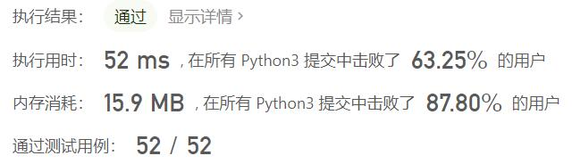

# 324-摆动排序II

Author：_Mumu

创建日期：2022/06/28

通过日期：2022/06/28

*****

踩过的坑：

1. 轻松愉快（摆了

已解决：383/2688

*****

难度：中等

问题描述：

给你一个整数数组 nums，将它重新排列成 nums[0] < nums[1] > nums[2] < nums[3]... 的顺序。

你可以假设所有输入数组都可以得到满足题目要求的结果。

 

示例 1：

输入：nums = [1,5,1,1,6,4]
输出：[1,6,1,5,1,4]
解释：[1,4,1,5,1,6] 同样是符合题目要求的结果，可以被判题程序接受。
示例 2：

输入：nums = [1,3,2,2,3,1]
输出：[2,3,1,3,1,2]

提示：

1 <= nums.length <= 5 * 104
0 <= nums[i] <= 5000
题目数据保证，对于给定的输入 nums ，总能产生满足题目要求的结果

进阶：你能用 O(n) 时间复杂度和 / 或原地 O(1) 额外空间来实现吗？

来源：力扣（LeetCode）
链接：https://leetcode.cn/problems/wiggle-sort-ii