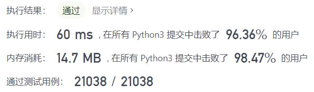
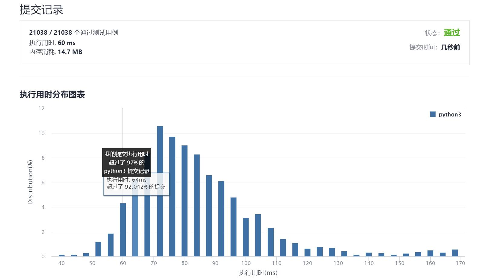

# 326-3的幂

Author：_Mumu

创建日期：2021/9/23

通过日期：2021/9/23

*****

踩过的坑：

1. 两种思想，给的数一直除以3，或者从1开始一直乘以3
2. 我是没想到限制数据范围后直接用最大的3的幂求余数就行，妙啊

已解决：97/2363

*****

难度：简单

问题描述：

给定一个整数，写一个函数来判断它是否是 3 的幂次方。如果是，返回 true ；否则，返回 false 。

整数 n 是 3 的幂次方需满足：存在整数 x 使得 n == 3x

 

示例 1：

输入：n = 27
输出：true
示例 2：

输入：n = 0
输出：false
示例 3：

输入：n = 9
输出：true
示例 4：

输入：n = 45
输出：false

提示：

-231 <= n <= 231 - 1

进阶：

你能不使用循环或者递归来完成本题吗？

来源：力扣（LeetCode）
链接：https://leetcode-cn.com/problems/power-of-three
