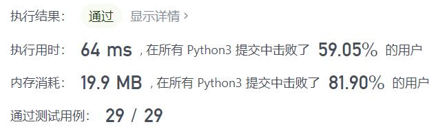
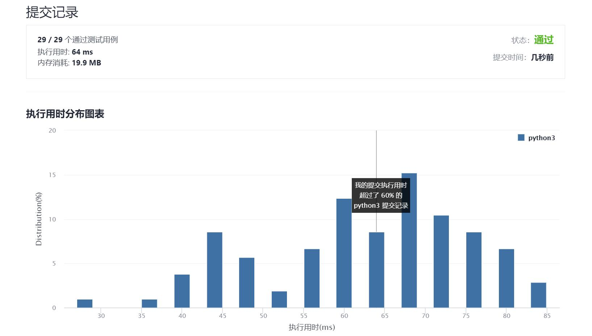

# 335-路径交叉

Author：_Mumu

创建日期：2021/10/29

通过日期：2021/10/29

*****

踩过的坑：

1. 因为时间不够只好先复制答案打卡再自己写惹
2. 结果复制的时候瞄到了题解的思路，虽然只瞄到了一丢丢，但是也对我的思考有了巨大的影响
3. 纯分类讨论
4. 3条路径不可能交叉，4、5、6条都有可能，更多条的都可以等价地视作6条以下的情况
5. 而其中5条交叉的情况比较特殊，当不是在前5条路径上发生这种情况时都可以归结为6条路径交叉的情况，从而缩短运行时间
6. 很少见到这种困难在思考上而非代码上的困难题

已解决：132/2407

*****

难度：困难

问题描述：

给你一个整数数组 distance 。

从 X-Y 平面上的点 (0,0) 开始，先向北移动 distance[0] 米，然后向西移动 distance[1] 米，向南移动 distance[2] 米，向东移动 distance[3] 米，持续移动。也就是说，每次移动后你的方位会发生逆时针变化。

判断你所经过的路径是否相交。如果相交，返回 true ；否则，返回 false 。

 

示例 1：

输入：distance = [2,1,1,2]
输出：true
示例 2：

输入：distance = [1,2,3,4]
输出：false
示例 3：

输入：distance = [1,1,1,1]
输出：true

提示：

1 <= distance.length <= 105
1 <= distance[i] <= 105

来源：力扣（LeetCode）
链接：https://leetcode-cn.com/problems/self-crossing
