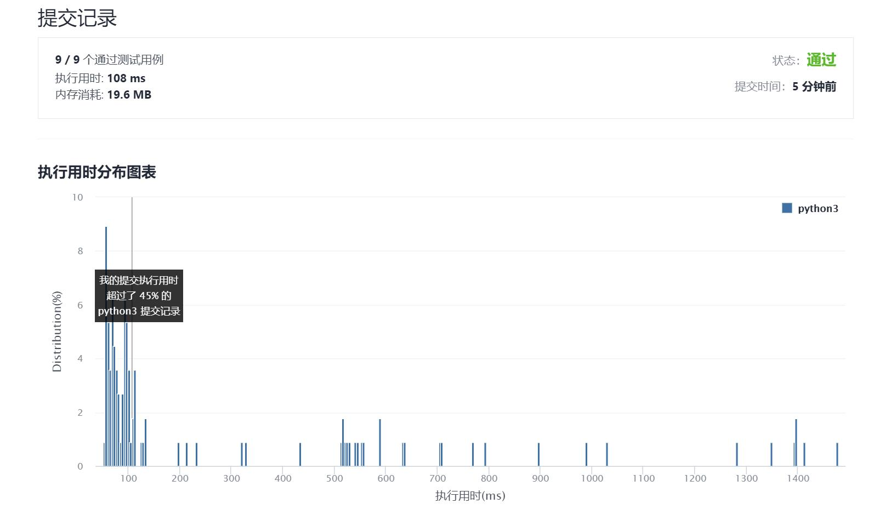

# 352-将数据流变为多个不相交区间

Author：_Mumu

创建日期：2021/10/9

通过日期：2021/10/9

*****

踩过的坑：

1. 其实也不难，就是插入时实时维护区间，维护时分类讨论即可
2. 就是细节处理比较复杂，照着题解才写出来

已解决：111/2386

*****

难度：困难

问题描述：

 给你一个由非负整数 a1, a2, ..., an 组成的数据流输入，请你将到目前为止看到的数字总结为不相交的区间列表。

实现 SummaryRanges 类：

SummaryRanges() 使用一个空数据流初始化对象。
void addNum(int val) 向数据流中加入整数 val 。
int[][] getIntervals() 以不相交区间 [starti, endi] 的列表形式返回对数据流中整数的总结。

示例：

输入：
["SummaryRanges", "addNum", "getIntervals", "addNum", "getIntervals", "addNum", "getIntervals", "addNum", "getIntervals", "addNum", "getIntervals"]
[[], [1], [], [3], [], [7], [], [2], [], [6], []]
输出：
[null, null, [[1, 1]], null, [[1, 1], [3, 3]], null, [[1, 1], [3, 3], [7, 7]], null, [[1, 3], [7, 7]], null, [[1, 3], [6, 7]]]

解释：
SummaryRanges summaryRanges = new SummaryRanges();
summaryRanges.addNum(1);      // arr = [1]
summaryRanges.getIntervals(); // 返回 [[1, 1]]
summaryRanges.addNum(3);      // arr = [1, 3]
summaryRanges.getIntervals(); // 返回 [[1, 1], [3, 3]]
summaryRanges.addNum(7);      // arr = [1, 3, 7]
summaryRanges.getIntervals(); // 返回 [[1, 1], [3, 3], [7, 7]]
summaryRanges.addNum(2);      // arr = [1, 2, 3, 7]
summaryRanges.getIntervals(); // 返回 [[1, 3], [7, 7]]
summaryRanges.addNum(6);      // arr = [1, 2, 3, 6, 7]
summaryRanges.getIntervals(); // 返回 [[1, 3], [6, 7]]

提示：

0 <= val <= 104
最多调用 addNum 和 getIntervals 方法 3 * 104 次

进阶：如果存在大量合并，并且与数据流的大小相比，不相交区间的数量很小，该怎么办?

来源：力扣（LeetCode）
链接：https://leetcode-cn.com/problems/data-stream-as-disjoint-intervals
