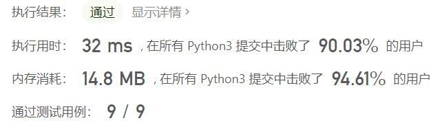
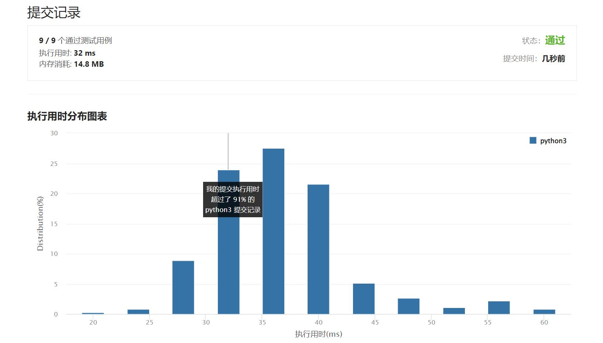

# 357-统计各位数字都不同的数字个数

Author：_Mumu

创建日期：2022/04/11

通过日期：2022/04/11

*****

踩过的坑：

1. 轻松愉快
1. 主场数学题，题解的代码还没爷的优雅

已解决：306/2591

*****

难度：中等

问题描述：

给你一个整数 n ，统计并返回各位数字都不同的数字 x 的个数，其中 0 <= x < 10n 。

示例 1：

输入：n = 2
输出：91
解释：答案应为除去 11、22、33、44、55、66、77、88、99 外，在 0 ≤ x < 100 范围内的所有数字。 
示例 2：

输入：n = 0
输出：1

提示：

0 <= n <= 8

来源：力扣（LeetCode）
链接：https://leetcode-cn.com/problems/count-numbers-with-unique-digits