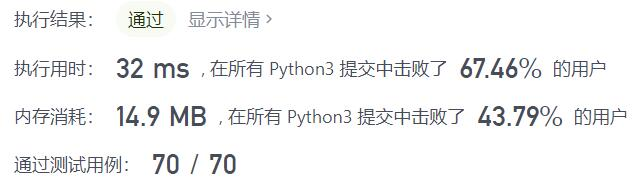
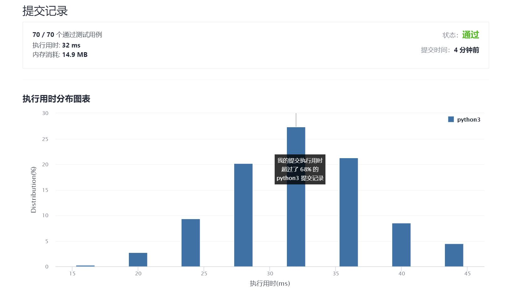

# 367-有效的完全平方数

Author：_Mumu

创建日期：2021/11/04

通过日期：2021/11/04

*****

踩过的坑：

1. 牛顿法可还行，唤醒了一些尘封的记忆

已解决：141/2416

*****

难度：简单

问题描述：

给定一个 正整数 num ，编写一个函数，如果 num 是一个完全平方数，则返回 true ，否则返回 false 。

进阶：不要 使用任何内置的库函数，如  sqrt 。

 

示例 1：

输入：num = 16
输出：true
示例 2：

输入：num = 14
输出：false

提示：

1 <= num <= 2^31 - 1

来源：力扣（LeetCode）
链接：https://leetcode-cn.com/problems/valid-perfect-square
